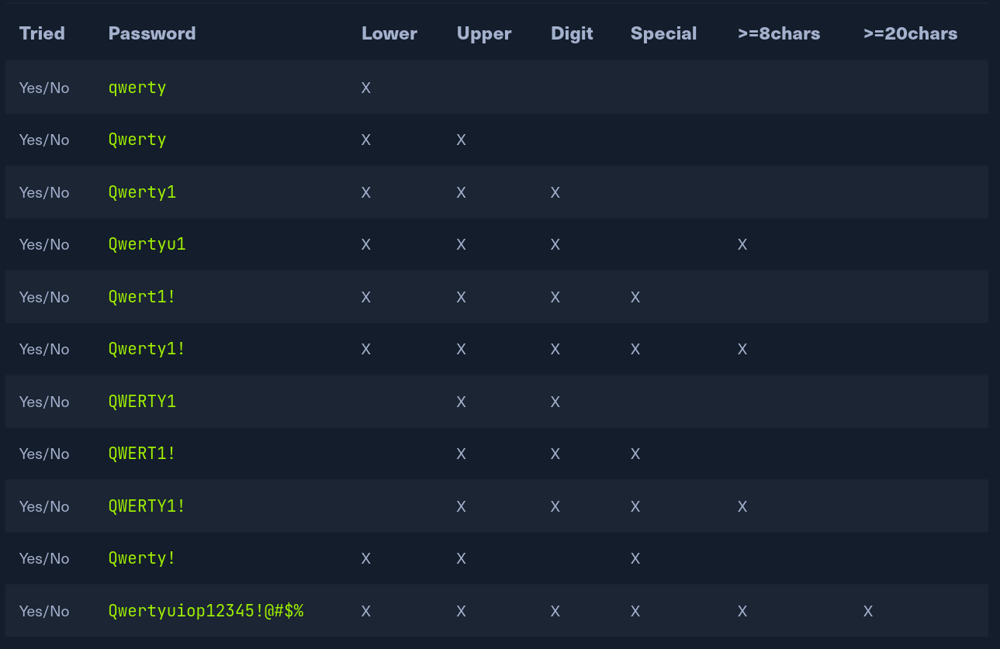
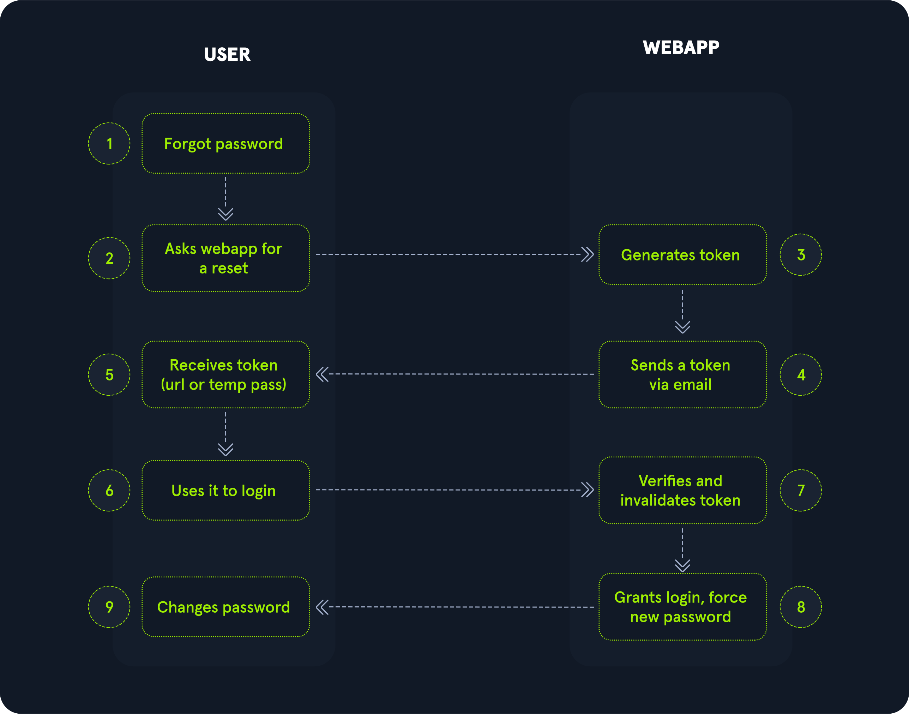

# Default Credentials

- find devices with default credentials due to human error or a breakdown in/lack of proper process
- https://nvd.nist.gov/vuln/detail/CVE-2020-29583
- https://nvd.nist.gov/vuln/search/results?cwe_id=CWE-798

## Default username and passwords resources

- Default username and password lists - https://www.cirt.net/passwords
- https://github.com/scadastrangelove/SCADAPASS/blob/master/scadapass.csv
- https://www.cirt.net/passwords?criteria=cisco

- Try at least
	- admin:admin
	- admin:password
	- empty:Cisco
	- cisco:cisco
	- Cisco:Cisco
	- cisco:router
	- tech:router
	- user:user
	- tech:tech

---

# Weak Bruteforce Protections

- to prevent automated attacks, the most common protections are
	- CAPTCHA
	- Rate Limits

## CAPTCHA

- Completely Automated Public Turing test to tell Computers and Humans Apart
- some developers often skip this protection and others prefer to present a CAPTCHA after some login failed to retain a good user experience
- some use a custom or weak implementation of CAPTCHA
- read the page's source code to configure how the CAPTCHA is generated and try to bypass it

## Rate Limiting

- having a counter that increments after each failed attempt
- eg - user cna try to login three times and they must wait 1 minute before trying again 

## Insufficient Protections

- attacker can bypass all or some protections by 
	- changing `User-Agent` header
	- `X-Forwarded-For` 
```php
<?php
// get IP address
if (array_key_exists('HTTP_X_FORWARDED_FOR', $_SERVER)) {
	$realip = array_map('trim', explode(',', $_SERVER['HTTP_X_FORWARDED_FOR']))[0];
} else if (array_key_exists('HTTP_CLIENT_IP', $_SERVER)) {
	$realip = array_map('trim', explode(',', $_SERVER['HTTP_CLIENT_IP']))[0];
} else if (array_key_exists('REMOTE_ADDR', $_SERVER)) {
	$realip = array_map('trim', explode(',', $_SERVER['REMOTE_ADDR']))[0];
}

echo "<div>Your real IP address is: " . htmlspecialchars($realip) . "</div>";
?>
```

- https://nvd.nist.gov/vuln/detail/CVE-2020-35590

---

# Brute Forcing Usernames

- usernames are often less complicated than passwords
- rarely contain special characters 
- usernames can also be harvested by crawling a web application or using public information 
- some web applications reveal that a username exists or not and password correct or not

### 1. User Unknown Attack

- check for generic usernames such as `helpdesk, tech, admin, demo, guest`
- Seclist - `/Usernames/top-usernames-shortlist.txt`

### 2. Username existence inference

- sometimes, web applications prefill the username input value if the username is valid and known but leave the input value empty or with a default value when the username is unknown
- common in mobile version websites
- though uncommon, it is possible that different cookies are set when a username is valid or not; eg - to check for password attempts using client-side controls, it is set and checked a cookie named "failed_login" only when the username is valid
- carefully inspect responses watching for differences in both HTTP headers and the HTML source code

### 3. Timing Attack

- an authentication function where the username and password are checked sequentially ; eg - code
```php
<?php
// connect to database
$db = mysqli_connect("localhost", "dbuser", "dbpass", "dbname");

// retrieve row data for user
$result = $db->query('SELECT * FROM users WHERE username="'.safesql($_POST['user']).'" AND active=1');

// $db->query() replies True if there are at least a row (so a user), and False if there are no rows (so no users)
if ($result) {
  // retrieve a row. don't use this code if multiple rows are expected
  $row = mysqli_fetch_row($result);

  // hash password using custom algorithm
  $cpass = hash_password($_POST['password']);
  
  // check if received password matches with one stored in the database
  if ($cpass === $row['cpassword']) {
	echo "Welcome $row['username']";
  } else {
    echo "Invalid credentials.";
  } 
} else {
  echo "Invalid credentials.";
}
?>
```

- in above code, it connects to the database and executes a query to retrieve the entire row where the username matches the user input
- if there is no result, no operation and show directly to invalid credentials
- if result is true, the provided password is hashed and compare and it will take time and it will have longer response time
- if the algorithm used was a fast one, time differences would be smaller and can get false positive
- **test with timing.py** 

- the attack is still possible by repeating a large number of requests to create a model
- **test with compare_encrypt_algos.py** for timing

### 4. Enumerate through Password Reset

- resets forms are often less well protected than login ones
- often leak information about valid or invalid username, eg -
	- if valid username -> return a message "You should receive a message shortly"
	- if not valid -> "Username unknown, check your data"
- but this method is noisy as some valid users will probably receive an email that asks for a password reset

### 5. Enumerate through Registration Form

- a registration form that prompts users to choose their username usually replies with a clear message when the selected username already exists 
- one interesting feature of email addresses is sub-addressing
- in RFC5233 -> `+tag` in the left part of an email address should be ignored by the Mail Transport Agent (MTA) and used as a tag for sieve filters
- eg - email address like `student+htb@hackthebox.eu` will deliver the email to `student@hackthebox.eu` 
- very few web applicaitons respect this RFC which leads to the possibility of registering almost infinite users by using a tag and only one actual email address

### 6. Predictable Usernames

- like `user1000, user1001, support.it, support.fr, etc`

---

# Brute Forcing Passwords

- wiki page for most common passwords - https://en.wikipedia.org/wiki/List_of_the_most_common_passwords

## Password Issues

1. users think that a password can be just a word and not a phrase
2. users mostly set passwords that are easy to remember or even if user chooses a more complex password, it will usually be written on a Post-it or saved in cleartext which is not uncommon to find the password in the hint field
	- NIST guideline for password - https://pages.nist.gov/800-63-3/sp800-63b.html

	`Verifiers SHOULD NOT impose other composition rules (e.g., requiring mixtures of different character types or prohibiting consecutively repeated characters) for memorized secrets. Verifiers SHOULD NOT require memorized secrets to be changed arbitrarily (e.g., periodically).`
3. users reuse the same password on multiple services


## Policy Inference

- the chance of executing a successful brute force attack increase after a proper policy evaluation
- infer the password policy by registering a new user
- try to use the username as a password or very weak password like 123456
- check it will pop up error such as at least one letter, one number ... etc
- as a developer always choose long passphrases over short
- eg- knowing what the minimum password requirements are
- policy requirements define how many different families of characters are needed and the length of the password itself
	- lowercase characters - `abcde...z`
	- uppercase characters - `ABCDE...Z`
	- digit, numbers - `0-9`
	- special characters - `,./.?! ` (space is a char)
- same attack could be carried on a **password reset page**
- reset form may leak the password policy 

### How to guess

- register an account and entering password like `Qwertyuiop123!@#` which is long and complex enough to match standard policies
- if the web app accepts such passwords as valid, decrease complexity by removing the special characters, numbers, uppercase chars, and decreasing the length by one character at a time
- some apps limit password length by forcing users to have a password between 8 and 15 chars
- use the following table to keep track of the tests



- within a few tries, we should be able to infer the policy even if the message is generic
- suppose the web app requires a string between 8 and 12 characters with at least one uppercase and one lowercase char
- from giant wordlist and extract only passwords that match this policy using grep 

- grep at least one uppercase, one lowercase with length of 8 to 12 chars
```sh
grep '[[:upper:]]' rockyou.txt | grep '[[:lower:]]' | grep -E '^.{8,12}$'
```

--- 

# Predictable Reset Token

- Reset tokens - secret pieces of data generated by the application when a password reset is requested
- user must provide it to prove their identity before actually changing their credentials
- some applications require to choose one or more security questions and provide an answer at the time of registration
- if you forgot your password, you can reset it by answering these questions again
- consider these answers as tokens

### Basic Reset Flow 



1. Client -> Forgot password 
2. Client -> Asks webapp for a reset
3. Server -> Generate token
4. Server -> Sends a token via email
5. Client -> Receives token (url or temp pass)
6. Client -> Uses it to login
7. Server -> Verifies and invalidates token
8. Server -> Grants login, force new password
9. Client -> Change password

- token received mainly by e-mail and could be embeded in an HTTP link that can be validated using a simple GET call like 
`https://example.com/reset.php?token=any-random-character-sequence`


### Reset Token by Email

- app lets the user reset the password using a URL or a temporary password sent by email, it should contain a robust token generation function

### Weak Token Generation

- some apps create token using known or predictable values such as local time or the username that requested he action and then hash or encode the value
- try brute force any weak hash using known combinations like `time+username` or `time+email` when a reset token is requested for a given user
- https://www.cvedetails.com/cve/CVE-2016-0783/
```php
<?php
function generate_reset_token($username) {
  $time = intval(microtime(true) * 1000);
  $token = md5($username . $time);
  return $token;
}
```
- play around with `reset_token_time.py`

- there are the time of a sent or received in-app message, an email header, or last login time, to name a few
- some apps do not check for the token age, giving an attacker plenty of time for a brute force attack
- some apps never invalidate or expire tokens even if the token has been used and if someone use the old token if found somewhere

### Short tokens

- app might generate a token with a length of 5/6 numerical characters that can easily be brute-forced
- consdier app replies with a `Valid token` message if the submitted token is valid and `Invalid token` if it is not valid
	- can use `wfuzz` or other to brute-force
	- 
	```
	wfuzz -z range,00000-99999 --ss "Valid" "https://brokenauthentication.hackthebox.eu/token.php?user=admin&token=FUZZ"
	```
	- `--ss` - case-sensitive string
	- `--hs` - reverse match (that does not contain)
- this attack is loud and also cause DOS and should be executed with great care

### Weak Cryptography

- https://labs.withsecure.com/advisories/opencart-predictable-password-reset-tokens
- applicatin uses the [mt_rand() PHP function](https://www.php.net/manual/en/function.mt-rand.php) is known [to be vulnerable](https://phpsecurity.readthedocs.io/en/latest/Insufficient-Entropy-For-Random-Values.html) due to the lack of sufficient entropy during the random value generation process
- proof of concept that attacks mt_rand() 
	- https://github.com/GeorgeArgyros/Snowflake
	- https://download.openwall.net/pub/projects/php_mt_seed/

### Reset Token as Temp Password

- some app use reset tokens as actual temporary passwords then any temp password should be invalidated as soon as the user logs in and changes it
- check if any reset tokens being used as temporary passwords can be reused
- there are higher chances that temporary passwords are being generated using a predictable algorithm like 
	- `mt_rand()`
	- `md5(username)`
	- and make sure to check these token 
