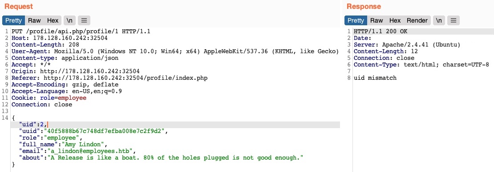
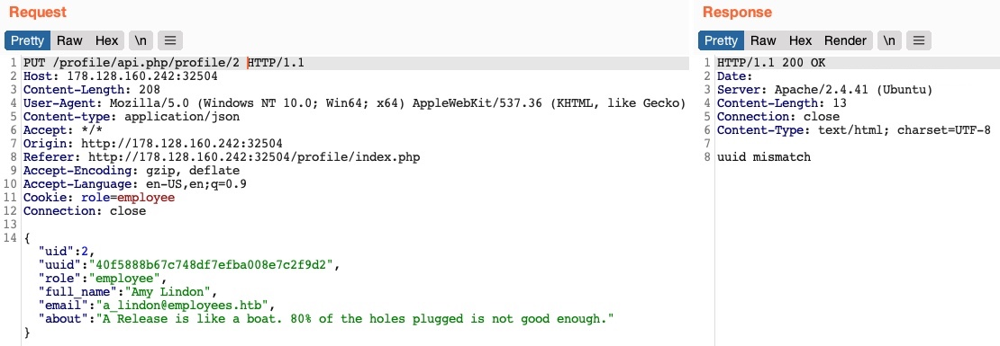
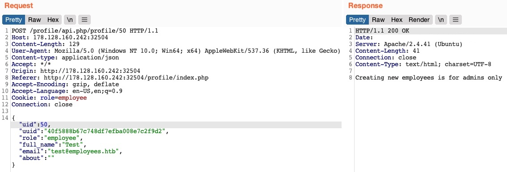
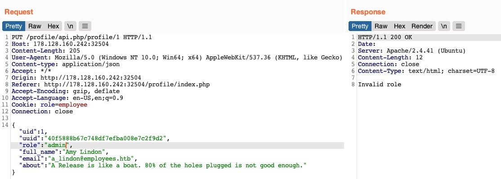
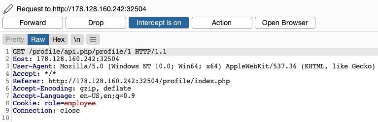
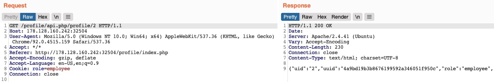
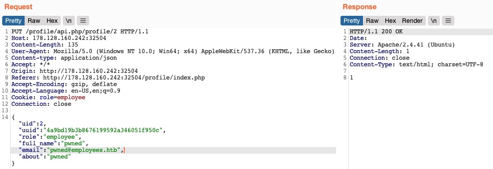
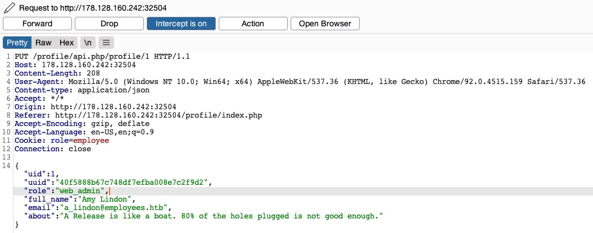

# Intro to IDOR

- Insecure Direct Object References (IDOR) 
- most common web vulnerabilities
- significantly impact the vulnerable web application
- occur when a web application exposes a direct reference to an object like a file, database resource which the end-user can directly control to obtain access to other similar objects
- if any user can access any resource due to the lack of a solid access control system, the system is considered to be vulnerable

## What makes an IDOR vulnerability

- just exposing a direct reference is not a vulnerability in itself
- may make it possible to exploit another vulnerability: weak access control system
- there are many ways of implementing a solid access control system for web applications, like Role-Based Access Control (RBAC) 
- IDOR vulnerability mainly exists due to the lack of an access control on the back-end

## Impact of IDOR vulnerability

- accessing private files and resources of other users that sould not be accessible to use like personal files or credit card data (**IDOR Information Disclosure Vulnerabilities**)
- depends on the nature of the exposed direct reference, vulnerability may range from modification or deletion of other user's data to complete account takeover
	- direct references may be database IDs or URL parameters which are used to test specific patterns to see whether they can gain access to any data and may eventually understand how to extract or modify data for any arbitary user
- may lead to elevation of user privileges from standard user to administrator (**IDOR Insecure Function Calls**)
	- eg - many web apps expose URL parameters or APIs for admin-only functions in the front-end code of the web app and disable to non-admin users
	- if we had access to such parameters or APIs, we may call them with our standard user privileges
	- suppose the back-end did not explicitly deny non-admin users from calling these functions, we may be able to perform unauthorized administrative operations like changing users' passwords or granting users certain roles which may lead to a total takeover of the entire web application

---

# Identifying IDORs

## URL Parameters & APIs

- First step is to Identify Direct Object References
- whenever we receive a specific file or resource, we should study the HTTP requests to look for URL parameters or APIs with an object reference (eg - `?uid=1`, `?filename=file_1.txt`)
- commonly found in URL parameters or APIs and may also be found in other HTTP headers like cookies
- try incrementing the values of the object references to retrieve other data like `?uid=2` or `?filename=file_2.txt` 
- use a fuzzing application to try thousands of variations and see if they return any data
- any successful hits to files that are not our own would indicate an IDOR vulnerability

## AJAX Calls

- Identify unused parameters or APIs in the front-end code in the form of JS AJAX calls
- some web apps may insecurely place all function calls on the front-end and use the appropriate ones based on the user role
- eg 
	- we did not have an admin account
	- only the user-level functions would be used 
	- the admin functions would be disabled
	- BUT we may still be able to *find the admin functions* if we look into the front-end JS code and may be able to *identify AJAX calls to specific end points or APIs* that contain direct object references
	- if we identify direct object references in the JS code, we can test them for IDOR vulnerabilities
	- not unique to admin functions, can be any functions or calls that may not be found through monitoring HTTP requests
	- example of AJAX call

```javascript
function changeUserPassword() {
	$.ajax({
		url: "change_password.php",
		type: "post",
		dataType: "json",
		data: {uid: user.id, password: user.password, is_admin: is_admin},
		success: function(result) {
			// ...
		}
	})
}
```

- this function may never be called when we use the web app as a non-admin user
- but, if we locate it in the front-end code, we may test it in different ways to see whether we can call it to perform changes 
- we can do the same with back-end code if we have access to it

## Understand Hashing/Encoding

- some applications may use object references by encoding or hashing
- eg 
	- `?filename=ZmlsZV8xMjMucGRm` which is base64 encode `file_123.pdf` and can change to `file_124.pdf` with base64 encode
	- `download.php?filename=c81e728d9d4c2f636f067f89cc14862c` which is hashed and not easy to encode
	- but if we look at the source code, we may see what is being hashed before the API call is made

```javascript
$.ajax({
	url: "download.php",
	type: "post",
	dataType: "json",
	data: {filename: CryptoJS.MD5("file_1.pdf").toString()},
	success: function(result) {
		//...
	}
})
```
- in this case, we can see that code uses the filename and hashing it with md5 and easy to calculate the filename for other potential files
- or can try manually to identify the hashing algorithm being used with hash identifier tools 
- once we calculate hashes for other files, we may try downloading them which may reveal an IDOR vulnerability if we can download any files that do not belong to us

## Compare User Roles

- need to register multiple users and compare their HTTP requests and object references
- allow to understand how the URL parameters and unique identifiers are being calculated and calculate them for other users to gather their data
- eg - if we had access to two differnet users, one of which can view their salary after making the following API call

```json
{
	"attributes":
		{
			"type": "salary",
			"url": "/services/data/salaries/users/1"
		},
	"Id": "1",
	"Name": "User1"
}
```

- the second user may not have all of these API parameters to replicate the call and should not be able to make the same call as *User1*
- such cases may work if the web application only requires a valid logged-in session to make the API call but has no access control on the back-end to compare the caller's session with the data being called
- if we can calculate the API parameters for other users, this would be an IDOR vulnerability 
- even if we could not calculate the API parameters for other users, we would still have identified a vulnerability in the back-end access control system and may start looking for other object references to exploit

---

# Mass IDOR Enumeration

## Insecure Parameters

- suppose a web application, which hosts employee records a
	- need to log in 
	- if we go to `/documents.php`, we see several documents that belong to log in user
	- users can upload files and those files are saved as `/documents/Invoice_1_09_2021.pdf`, `/documents/Report_1_10_2021.pdf`
	- those file names are easy to fuzz 
	- `Static Filed IDOR`
- when user1 request a file and endpoint may look like `documents.php?uid=1`
	- which use `uid` GET parameter as a direct reference to the record file
	- try to change this uid value,  
	- if the back-end of the web app does have a proper access control system, we will get some form of Access Denied error
- suppose we try to change uid to 2 and get no differnece in the page output
	- always keep an eye on the source code and page size
	- even though no difference, if we clicked the linked files, there may be differnet files

## Mass Enumeration

- we can try manually for getting the files like `uid=2`, `uid=3` 
- but for many files, Burp Intruder or Zap Fuzzer can be used 
- suppose if we inspect the source code and found that
```html
<li class='pure-tree_link'><a href='/documents/Invoice_3_06_2020.pdf' target='_blank'>Invoice</a></li>
<li class='pure-tree_link'><a href='/documents/Report_3_01_2020.pdf' target='_blank'>Report</a></li>
```
- we can grep the link of the file with curl and grep as follows

```sh
curl -s "http://vuln-website.com/documents.php?uid=1" | grep "<li class='pure-tree_link'>"
```
```sh
curl -s "http://vuln-website.com/documents.php?uid=1" | grep -oP "\/documents.*?.pdf"
```

- can use a simple bash script
```bash
#!/bin/bash
url = "http://vuln-website"
for i in {1..10}; do
	for link in $(curl -s "$url/documents.php?uid=$i" | grep -oP "\/documents.*?.pdf"); do
		wget -q $url/$link
	done
done
```

---

# Bypassing Encoded References

- in some cases, web applications make hashes or encode their object references, making enumeration more difficult
- eg -
	- POST request to `/download.php` with the following data
	- `contract=cdd96d3cc73d1dbdaffa03cc6cd7339b`
	- which seesm to be md5 hash
	- hashes are one-way functions and we cannot decode them to see their original values
	- we can attempt to hash various values, like uid, username, filename and many others and see any of their md5 hashes match the above value
	- if we find a match, we can replicate it for other users and collect their files


## Function Disclosure

- sometimes, developers may make the mistake of performing sensitive functions on the front-end, which would expose them to attackers
- if the above hash was being calculated on the front-end, we can study the function and then replicate what it's doing to calculate the same hash
- suppose if we look at the source code and found that JS function with `javascript:downloadContract('1')` is called and look at the `downloadContract()` function 
```javascript
function downloadContract(uid) {
	$.redirect("/download.php", {
		contract: CryptoJS.MD5(btoa(uid)).toString(),
	}, "POST", "_self");
}
```
- we can see that the hash value is just uid value which is encoded with base64 and then hash with md5

```sh
echo -n 1 | base64 -w 0 | md5sum
```
- -n and -w 0 flag to avoid adding newlines in bash

```python
In [1]: import hashlib

In [2]: import base64

In [3]: a = '1'

In [4]: b = base64.b64encode(str(a).encode())

In [5]: hashlib.md5(b).hexdigest()
Out[5]: 'cdd96d3cc73d1dbdaffa03cc6cd7339b'
```

## Mass Enumeration

- write a sample bash script to retrieve all data
- create from 1 - 10 for above function

```sh
for i in {1..10}; do echo -n $i | base64 -w 0 | md5sum | tr -d ' -'; done
```
- make a POST request on `/download.php` with each of the above hashes as the `contract` value

```sh
for i in {1..10}; do
	for hash in $(echo -n $i | base64 -w 0 | md5sum | tr -d ' -'); do
		curl -sOJ -X POST -d "contract=$hash" http://vuln-website/download.php
	done
done
```

# IDOR in Insecure APIs

- IDOR vulns may also be found in function calls and APIs
- `IDOR Information Disclosure Vulnerabilities` allows to read various types of resorces
- `IDOR Insecure Function Calls` call APIs or execute functions as another user
- such functions and APIs can be used to change anotehr user's private information, reset another user's password or even buy items using another user's payment information

## Identifying Insecure APIs

- suppose a website has a functionality to change the user profile with name, email and about me
- after changing the data, will make PUT request like
```
PUT /profile/api.php/profile/1 HTTP/1.1
Host: vuln-website.com
...
{
    "uid": 1,
    "uuid": "40f5888b67c748df7efba008e7c2f9d2",
    "role": "employee",
    "full_name": "Amy Lindon",
    "email": "a_lindon@employees.htb",
    "about": "A Release is like a boat. 80% of the holes plugged is not good enough."
}
```
- interesting parameter in here is `role` which is set to employee
- the web application also appears to be setting the user access privileges on the client side in the form of `Cookie: role=employee` which appears to reflect the role specific for our user
- this is a common security issue
- accsess control privileges are sent as part of the client's HTTP request, either a cookie or as part of JSON request leaving it under the client's control 
- **we should be able to set an arbitary role for our user, which may grant us more privileges**
- **BUT, how would we know what other roles exist?**

## Exploiting Insecure APIs

- try to manipulate the other parameters
- there are a few thing we can try in this case
1. Change the `uid` to another user's `uid` such that we can take over their accounts
2. Change another user's details, which may allow us to perform several web attacks
3. Create new users with arbitary details or delete existing users
4. Change our role to a more privileged role (eg - admin) to be able to perform more actions

- suppose we try to change the uid of another user's (eg - uid=2 in this case)
- will get uid mismatch



- this app appears to compare the request's uid to the API endpoint(/1)

- perhaps we can try changing another user's details
- try to change the API endpoint to `/profile/api.php/profile/2` and change `"uid":2`



- we'll get an error "uuid mismatch"
- this app appears to be checking if the uuid value we are sending matches the user's uuid
- this appears to be another form of access control to prevent users from changing another user's details

- try to create a new user with a POST request to the API endpoint
- we can change the request method to POST, change the uid to a new uid and send the request to the API endpoint of the new uid



- we get an error message "Creating new employees is for admins only"
- same thing happens when we send a Delete request "Deleting employees is for admins only"
- this web app might be checking our authorization through the `role=employee` cookie as this appears to be the only form of authorization in the HTTP request

- finally try to change the `role` to `admin/administrator` 



- `Invalid role` 
- all of our attempts appear to have failed
- we cannot create, delete users, and change our role
- we cannot change our uid as there are preventive measures on the back-end that we cannot control nor can we change another user's details for the same reason
- **Is the web application secure against IDOR attacks?**
- we have only been testing the **IDOR Insecure Function Calls** 
- we have not tested the API's GET request for **IDOR Information Disclosure Vulnerabilities**
- if there was no robust accss control system in place, we might be able to read other user's details which may help us with the previous attacks we attempted
- **Try to test the API against IDOR Information Disclosure Vulnerabilities by attempting to get other user's details with GET requests**
- if the API is vulnerable, we may be able to leak other users' details and use this information to complete our IDOR attacks on the function calls

---

# Chaining IDOR Vulnerabilities

- usually a `GET` request to the API endpoint should return the details of the requested user
- try calling it to see if we can retrieve our user's details
- in above example, after the payloads, it fetches the user details with a GET request to the same API endpoint



- the only form of authorization in HTTP requests in this case is the `role=employee` cookie as the HTTP request does not contain any other form of user-specific authorization like JWT token 
- even if a token did exist, unless it was being actively compared to the requested object details by a back-end access control system, there may still be able to retrieve other users' details


## Information Disclosure



- send a GET request with another uid
- this returned the details of another user, with their own uuid and role confirming an **IDOR Information Disclosure Vulnerability**

```json
{
    "uid": "2",
    "uuid": "4a9bd19b3b8676199592a346051f950c",
    "role": "employee",
    "full_name": "Iona Franklyn",
    "email": "i_franklyn@employees.htb",
    "about": "It takes 20 years to build a reputation and few minutes of cyber-incident to ruin it."
}
```

## Modifying Other Users' Details

- now we get other users' uuid 
- we can change their details by sending a PUT request to `/profile/api.php/profile/2` (eg - 2 in this case) 



- then try to GET their details again and we can see that they had been updated

- in this example, it allows to view potentially sensitive details, the ability to modify another user's details also enables us to perform several other attacks
- other type of attack is modifying a user's email address and then requesting a password reset link which will be sent to the email address we specified, and allowing us to take control over their account
- another potential attack is placing an XSS payload in the about field which would get executed once the user visits their Edit profile page, enabling us to attack the user in different ways

## Chaining Two IDOR Vulnerabilities 

- try to write a script to enumerate all users 
- can find an admin user with the following details

```json
{
    "uid": "X",
    "uuid": "a36fa9e66e85f2dd6f5e13cad45248ae",
    "role": "web_admin",
    "full_name": "administrator",
    "email": "webadmin@employees.htb",
    "about": "HTB{FLAG}"
}
```

- we may modify the admin's details and perform one of the above attacks to take over their account
- we now know that admin role is `web_admin` and we can set it to our user and we can create new users, delete users, and so on



- try to change the admin role and get no error

- By combining the information we gained from the **IDOR Information Disclosure Vulnerability** with an **IDOR Insecure Function Calls** attacks on an API endpoint, we could modify other users' details and create/delete users while bypassing various access control checks in place
- the information we leak through IDOR vulnerabilities can be utilized in other attacks, like IDOR or XSS leading to more sophisticated attacks or bypassing existing security mechanisms
- with the admin role, we may perform mass assignments to change specific fields for all users, like placing XSS payloads in their profiles or changing their email to an email we specify
- Try to write a script that changes all users' email to an email you choose, etc

---

# Prevention

- first to build an object-level access control system 
- use secure references for our objects when storing and calling them

## Object-Level Access Control

- design has to support the segmentation of roles and permissions in a centralized manner
- user roles and permissions are a vital part of any access control system in role-bsed access control system
- map the RBAC to all objects and resources
- back-end server can allow or deny every request, depending on whether the requester's role has enough privileges to access the object or the resource
- each user would be assigned a role that has certain privileges
- upon every request the user makes, their roles and privileges would be tested to see if they have access to the object they are requesting
- only be allowed it if they have the right to do so

```javascript
match /api/profile/{userId} {
    allow read, write: if user.isAuth == true
    && (user.uid == userId || user.roles == 'admin');
}
```
## Object Referencing

- core issue with IDOR lies in broken access control (Insecure) having access to direct references to object (Direct Object Referencing) makes it possible to enumerate and exploit these access control vulnerabilities
- should never use object references in clear text or simple patterns (eg-uid=1)
- should use strong and unique references, like salted hashed or UUID's 

```php
$uid = intval($_REQUEST['uid']);
$query = "SELECT url FROM documents where uid=" . $uid;
$result = mysqli_query($conn, $query);
$row = mysqli_fetch_array($result));
echo "<a href='" . $row['url'] . "' target='_blank'></a>";
```
- should never calculate hashes on the front-end
- should generate them when an object is created and store them in the back-end databse
- create database maps to enable quick cross-referencing of objects and references
- using UUIDs may let IDOR vulns go undetected since it makes it more challenging to test for IDOR vulns

---