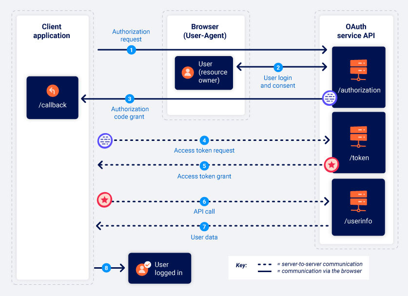

## What is OAuth?

- commonly used authorization framework that enables websites and web applications to request limited access to a user's account on another applicaton
- allows the user to grant this access without exposing thier login credentials to the requesting appliation
- OAuth 2.0 was written from scratch and very differnet from OAuth 1.0

## How does it work?

- works by defining a series of interactions between three distinct parties: _client application_, _resource owner_, _OAuth service provider_
  - **Client application** - website or web application that wants to access the user's data
  - **Resource owner** - user whose data the client application wants to access
  - **OAuth service provider** - website or application that controls the user's data and access to it
- most common flows or grant types involve the following stages
  1. The client application requests access to a subset of the user's data specifying which grant type they want to use and what kind of access they want
  2. The user is prompted to log in to the OAuth service and explicitly give their consent for the requested access
  3. The client appilcation receives a unique access token that proves they have permission from the user to access the requested data
  4. The client application uses this access token to make API calls fetching the relevant data from the resource server

## OAuth scopes

- for any OAuth grant type, the client application has to specify which data it wants to access and what kind of operations it wants to perform
- done by using the `scope` parameter of the authorization request it sends to the OAuth service
- scopes for which a client application can request access are unique to each OAuth service
- the scope is just an arbitary text string
- eg -
  ```
  scope=contacts
  scope=contacts.read
  scope=contact-list-r
  scope=https://oauth-authorization-server.com/auth/scopes/user/contacts.readonly
  ```

## OAuth Grant Types

- determines the exact sequence of steps that are involved in the OAuth process
- affects how the client application communicates with the OAuth service at each stage, including how the access token itself is sent (often referred to as "OAuth flows")
- OAuth service must be configure to support a particular grant type before a client application can initiate the corresponding flow and the client application specifies which grant type it wants to use in the initial authorization request it sends to the OAuth service
- there are several different grant types; most common are **authorization code** and **implicit grant type**

### Authorization code grant type

- the client application and OAuth service first use redirects to exchange a series of browser-based HTTP requests that initiate the flow
- the user is asked whether they consent to the requested access
- if they accept, the client application is granted an **authorization code**
- the client application then exchanges this code with the OAuth service to receive an **access token**, which they can use to make API calls to fetch the relevant user data
- all communication that takes place from the code/token exchange onward is sent server-to-server over a secure, preconfigured back-channel and invisible to the end user
- this secure channel is established when the client application first registers with the OAuth service, at this time, a `client_secret` is generated which the client application must use to authenticate itself when sending these server-to-server requests



#### 1. Authorization request

- the client application sends a request to the OAuth service's `/authorization` endpoint asking for permission to access specific user data; endpoint may vary

```
GET /authorization?client_id=123&redirect_uri=https://client-app.com/callback&response_type=code&scope=openid%20profile&state=ae13d489bd00e3c24 HTTP/1.1
Host: oauth-authorization-server.com
```

- this request contains the following parameters:
  - client_id - mandatory parameter containing the unique identifier of the client application and this value is generated when the client application registers with the OAuth service
  - redirect_uri - URI to which the user's browser should be redirected when sending the authorization code to the client application; known as **callback URI** or **callback endpoint**; many OAuth attacks are based on exploiting flaws the validation of this parameter
  - response_type - determines which kind of response the client application is expecting and which flow it wants to initiate; for the authorization code grant type, the value should be code
  - scope - used to specify which subset of the user's data the client application wants to access; there may be custom scopes
  - state - stores a unique, unguessable value that is tied to the current session on the client application; OAuth service should return this exact value in response along with the authorization code and serves as a form of CSRF token for the client application by making sure that the request to its `/callback` endpoint is from the same person who initiated the OAuth flow

#### 2. User login and consent

- when the authorization server receives the initial request, it will redirect the user to a login page, where they will be prompted to log in to their account
- then presented with a list of data that the client application wants to access which is based on the scopes defined in the authorization request; user have to choose whether or not to consent to this access

#### 3. Authorization code grant

- if the user consents to the requested access, their browser will be redirected to the `/callback` endpoint that was specified in the `redirect_uri` parameter of the authorization request

```
GET /callback?code=a1b2c3d4e5f6g7h8&state=ae13d489bd00e3c24 HTTP/1.1
Host: client-app.com
```

#### 4. Access token request

- once the client application receives the authorization code, it needs to exchange it for an access token and it sends a server-to-server POST request to the OAuth service's `/token` endpoint
- all communication from this point on takes place in a secure back-channel and cannot usually be observed or controlled by an attacker

```
POST /token HTTP/1.1
Host: oauth-authorization-server.com
...
client_id=12345&client_secret=SECRET&redirect_uri=https://client-app.com/callback&grant_type=authorization_code&code=a1b2c3d4e5f6g7h8
```

- client_secret - the client application must authenticate itself by including the secret key that it was assigned when registering with the OAuth service
- grant_type - used to make sure the new endpoint knows which grant type the client application wants to use

#### 5. Access token grant

- OAuth service will validate the access token request
- if everything is as expected, the server responds by granting the client application an access token with the requested scope

```json
{
    "access_token": "z0y9x8w7v6u5",
    "token_type": "Bearer",
    "expires_in": 3600,
    "scope": "openid profile",
    …
}
```

#### 6. API call

- the client application has the access code, it can fetch the user's data from the resource server
- makes an API call to the OAuth service's `/userinfo` endpoint
- the access token is submitted in the `Authorization: Bearer` header to prove that the client application has permission to access this data

```
GET /userinfo HTTP/1.1
Host: oauth-resource-server.com
Authorization: Bearer z0y9x8w7v6u5
```

#### 7. Resource grant

- the resource server should verify that the token is valid and that it belongs to the current client application
- respond by sending the requested resource or user's data based on the scope of the access token

```json
{
    "username": "carlos",
    "email": "carlos@carlos-montoya.net",
    ...
}
```

- the client application can use this data for its intended purpose

### Implicit Grant Type

- far less secure
- all communication happens via browser redirects and there is no secure back-channel like the authorization code flow and the sensitive access token and the user's data are more exposed to potential attacks
- more suited to single-page applications and native desktop applications which cannot easily store the `client_secret` on the back-end


#### 1. Authorization request

- same as authorization code flow and only major difference is that the `response_type` parameter must be set to `token`

```
GET /authorization?client_id=12345&redirect_uri=https://client-app.com/callback&response_type=token&scope=openid%20profile&state=ae13d489bd00e3c24 HTTP/1.1
Host: oauth-authorization-server.com
```

#### 2. User login and consent

- same as authorization code flow

#### 3. Access token grant

- if the user gives their consent to the requested access, this is where things start to differ
- OAuth service will redirect the user's browser to the `redirect_uri` specified in the authorization request
- instead of sending a query parameter containing an authorization code, it will send the access token and other token-specific data as a URL fragment

```
GET /callback#access_token=z0y9x8w7v6u5&token_type=Bearer&expires_in=5000&scope=openid%20profile&state=ae13d489bd00e3c24 HTTP/1.1
Host: client-app.com
```

- client application must use a suitable script to extract the fragment and store it

#### 4. API call

- once the client application has successfully extracted the access token from the URL fragment, it can use it to make API calls to the OAuth service's `/userinfo` endpoint
- unlike code flow, this happens via the browser

```
GET /userinfo HTTP/1.1
Host: oauth-resource-server.com
Authorization: Bearer z0y9x8w7v6u5
```

#### 5. Resource grant

- the resource server should verify that the token is valid and that it belongs to the current client application
- will respond by sending the requested resources

## How do Vulnerabilities arise?

- the OAuth specification is relatively vague and flexible by design
- security relies almost entirely on developers using the right combination of configuration options and implementing their own additional security measures on top such as robust input validation

### Identifying OAuth authentication

- if you see an option to log in using your account from a different website, this is a strong indication of OAuth
- in Burp proxy, can see a request to the `/authorization` endpoint containing a number of query parameters such as **client_id**, **redirect_uri** and **response_type** parameters
- eg -

```
  GET /authorization?client_id=12345&redirect_uri=https://client-app.com/callback&response_type=token&scope=openid%20profile&state=ae13d489bd00e3c24 HTTP/1.1
  Host: oauth-authorization-server.com

```

### Recon

- identify the specific provider from the hostname to which the authorization request is sent
- read the documentation about that service provider and can see how to extract useful information
- try to send a GET request to the following standard endpoints

  - `/.well-known/oauth-authorization-server`
  - `/.well-known/openid-configuration`

- this often return a JSON configuartion file containing key information such as details of the additional features that may be supported

## Exploiting OAuth authentication vulnerabilities

### In the client application

1. Improper implementation of the implicit grant type

- in implicit grant type, the access token is sent from the OAuth service to the client application via the user's browser as a URL fragment
- client application accesses the token using JS
- if the application wants to maintain the session after the user closes the page, it needs to store the current user data (eg - ID and access token) somewhere
- it often submit this data to the server in a POST request and assign the user a session cookie
- the server does not have any secrets or passwords to compare with the submitted data
- In this implicit flow, this POST request is exposed to attackers via thier browser
- if the client application doesn't check the access token matches the other data in the request, vulnerabilities arise
- an attacker can simply change the parameters sent to the server to impersonate any user

2. Flawed CSRF protection

- one important parameter for OAuth flow is `state`, which ideally contain an unguessable value such as hash of something tied to the user's session when it first initiate the OAuth flow
- this value is then passed back and forth between the client application and the OAuth service as a form of CSRF token for the client application
- if the authorization request does not send a `state` parameter, this is extremely interesting from an attacker's perspective
- they can initiate an OAuth flow themselves before tricking a user's browser into completing it like CSRF attack
-
