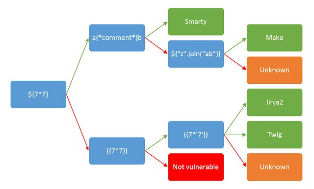

## What is server-side template injection?

- when an attacker is able to use native template syntax to inject a malicious payload into a template which is executed server-side
- occur when user input is concatenated directly into a template rather than passed in as data

## Impact

- at the severe end of the scale, an attacker can potentially achieve RCE
- often use as the basic for numerous attacks potentially gaining read access to sensitive data and arbitary files on the server

## How vulnerabilities arise?

- when user input is concatenated into templates rather than being passed in as data

- eg -

```php
$output = $twig->render("Dear {first_name}, ",array("first_name" => $user.first_name));
```

- This is not vulnerable to server-side template injection as the user's first name is merely passed into the template as data
- instead,

```php
$output = $twig->render("Dear " . $_GET['name']);
```

- this can be exploited by `http://vulnerable-website.com/?name={{bad-stuff-here}}`

## Constructing a server-side template injection attack

> Detect > Identify > Exploit >>> read > explore > attack

### Detect

- difficult to notice but if it has been noticed, it is easy to exploit
- try fuzzing the template by injecting a sequence of special characters commonly used in template expressions such as `${{<%[%'"}}%\`
- if an exception is raised, the injected template syntax is potentially being interpreted by the server in some way
- even if fuzzing did suggest a template injection vulnerability, it is still needed to identify its context in order to exploit it

#### Plaintext context

- eg - in Freemarker, `render('Hello ' + username)` will render to something like this `Hello Mary`
  - it can sometimes be exploited for XSS and often mistaken for a simple XSS vulnerabilities
  - try with Mathematical operation
  - `http://vuln-website.com/?username=${7*7}`
  - if output is `Hello 49`, it is a good proof of concept for a server-side template injection vulnerability

#### Code context

```php
greeting = getQueryParameter('greeting');
engine.render("Hello {{"+greeting+"}}", data)
```

On the website, the resulting URL would be like : `http://vuln-website.com/?greeting=data.username`

- output to `Hello Mary`
- How to test
  - first establish that the parameter doesn't contain a direct XSS vulnerability by injecting arbitary HTML into the value
    `http://vuln-website.com/?greeting=data.username<tag>`
  - in the absence of XSS, this will output as blank like `Hello `
  - then try to break out of the statement using common templating syntax and attempt to inject arbitary HTML after it
    `http://vuln-website.com/?greeting=data.username}}<tag>`
  - if error -> wrong template or no server side template injection
  - if output = `Hello Mary<tag>` -> server-side template injection present

### Identify

- once you have detected the template injection potentital, then identify the template engine
- simply submitting invalid syntax is often enough as the resulting error message will tell exactly what the template engine is and sometimes which version
- eg - invalid expression `<%=foobar%>` trigger the following error response from Ruby-based ERB engine

```
(erb):1:in `<main>': undefined local variable or method `foobar' for main:Object (NameError)
from /usr/lib/ruby/2.5.0/erb.rb:876:in `eval'
from /usr/lib/ruby/2.5.0/erb.rb:876:in `result'
from -e:4:in `<main>'
```

- OR you need to manually test different language-specific payloads and study how they are intrepreted by the template engine



- the payload `{{7*'7'}}`, in Twig -> return 49 and in Jinja2 '7777777'

```
${}
${7/0}
${foobar}
${7*7}
{{}}
{{7/0}}
{{foobar}}
{{7*7}}
<%= %>
<%= 7/0 %>
<%= foobar %>
``
```

### Exploit

- after detecting, next step is to find ways of exploiting it

#### Read

- read its documentation

1. Learn the basic template syntax

eg - for Python-based Mako template engine is being used, to achieve RCE is

```py
<%
import os
x = os.popen('id').read()
%>
${x}
```

2. Read about the security implications
3. Look for known exploits
4. Explore - many template engines expose a "self" or "environment" object
   - eg - in Java based `${T(java.lang.System).getenv()}`
