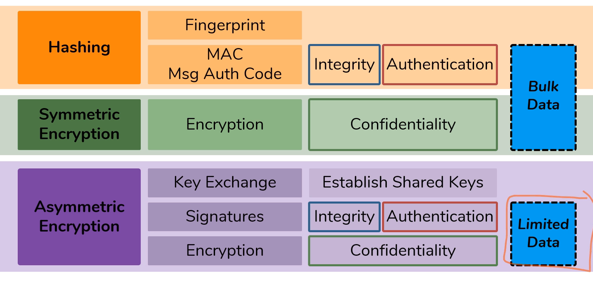
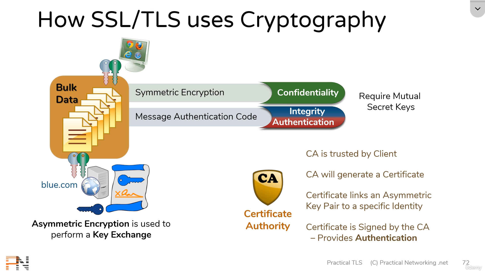
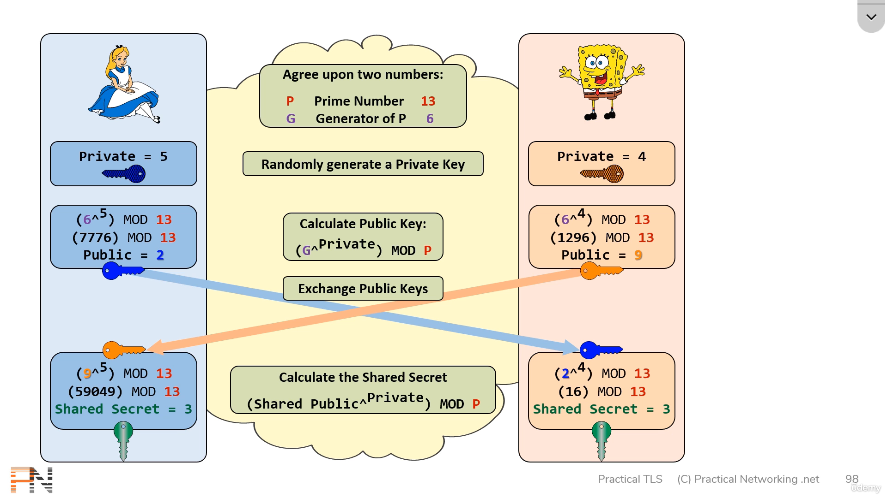

- notes from the course [Learn OpenSSL](https://www.udemy.com/course/openssl-cheatsheet/) from Udemy 

## Generating Public and Private Keys

### RSA
- Generate RSA Private Key
```sh
openssl genrsa -out rsa_key1.pem 1024
```
- convert RSA Private Key into text
- `-noout` not see base64 encoded version
```sh
openssl rsa -in rsa_key1.pem -text -noout
```

- Generate 4096 bit RSA private key, encrypted with AES128 (with password)
```sh
openssl genrsa -out rsa_key2.pem -aes128 4096
```
- other encryption algorithms  ->  `-aes192, -aes256, -des3, -des`

- Remove encryption from an RSA key file
```sh
openssl rsa -in rsa_key2.pem -out key.pem
```
- Add Encryption to RSA key file
```sh
openssl rsa -in key.pem -aes128 -out encrypted_key.pem
```


### DSA
- Generate DSA Parameters File
```sh
openssl dsaparam -out dsa_param.pem 1024
```
- inspecting DSA parameters File 
```sh
openssl dsaparam -in dsa_param.pem -text -noout
```

- Generate DSA Keys with Parameters File
```sh
openssl gendsa -out dsa_keys.pem dsa_params.pem
```
- inspecting DSA Private Key file
```sh
openssl dsa -in dsa_keys.pem -text -noout
```

- Generate DSA Parameters and Keys in one File
```sh
openssl dsaparam -genkey -out dsa_param_key.pem 2048
```

### Elliptic Curve Key

- Generate EC Parameter File
```sh
openssl genpkey -genparam -algorithm EC -pkeyopt ec_paramgen_curve:secp384r1 -out ec_param.pem
```
- Inspect EC Parameter file
```sh
openssl ecparam -in ec_param.pem -text -noout
```

- Generate EC Keys From Parameter File
```sh
openssl genpkey -paramfile ec_param.pem -out ec_key1.pem
```
- Inspect EC Private Key file
```sh
openssl ec -in ec_key1.pem -text -noout
```

- Generate EC Keys directly
```sh
openssl genpkey -algorithm EC -pekeyopt ec_paramgen_curve:P-384 -out ec_key2.pem
```

- view supported EC 
```sh
openssl ecparam -list_curves
```

#### Can inspect files using `pkey` 
```sh
openssl pkey -in rsa_param.pem -text -noout
openssl pkey -in dsa_param.pem -text -noout
```
- extract public key to send 
```sh
openssl pkey -in params.pem -pubout
```
- extract public key as text
```sh
openssl pkey -in params.pem -text_pub -noout
```


### Certificates and CSR (Certificate signing request)

#### Creating a CSR using an existing private key
```sh
openssl req -new -key ec_key.pem -out ec_csr.pem
```

#### Creating Certificates using an existing private key
```sh
openssl req -x509 -key ec_key.pem -out ec_cert.pem
```

#### Viewing x509 Certificate as text
```sh
openssl x509 -in CERT.pem -noout -text
openssl req -in CSR.pem -noout -text
```

#### Check if RSA Key matches a CSR or Cert
- compare Modulus values to see if files match each other
```sh
openssl req  -in CSR.pem  -noout -modulus
openssl x509 -in CERT.pem -noout -modulus
openssl rsa  -in KEY.pem  -noout -modulus
```

#### Check if EC key matches a CSR or Cert
- compare public key values to see if files match each other
```sh
openssl req  -in EC-CSR.pem  -noout -pubkey
openssl x509 -in EC-CERT.pem -noout -pubkey
openssl ec   -in EC-KEY.pem  -pubout #or
openssl pkey -in EC-KEY.pem  -pubout
```


## Theory

- SSL/TLS create a **secure, protected tunnel** across the Internet
- HTTPS - HTML transferred with HTTP protected by SSL
- SSL/TLS - protect other data transfer (eg- SSL VPN)

| **SSL** | **TLS** |
| --- | --- |
| Secure Sockets Layer | Transport Layer Security |
| created by NetScape in 1994 | SSL maintenance handled to IETF in 1999 and renamed protocol to TLS |

## How do SSL/TLS protect the data?

- Data sent across a wire can be captured by anyone in the middle 
- protect the data in three ways

| **Category** | **Meaning** | **How** |
| -------- | ------- | --- |
| Confidentiality | Data is only accessible by Client and Server | Encryption |
| Integrity | Data is not modified between Client and Server | Hashing |
| Authentication | Client/Server are indeed who they say they are | PKI |

- Anti-Replay
	- ကြားက ဖြတ်ယူ၊ ကော်ပီကူး၊ အများကြီး ပို့တာကို ကာကွယ်
	- what will happen if the attacker took and sent the copies of the data ? 
	- to prevent this replay, anti-replay mechanism comes into play by providing with built-in **sequence numbers**
	- built in to **Integrity + Authentication** mechanism 
- Non-Repudiation
	- ကျွန်တော်မပို့ပါဘူးလို့ လုပ်မရ
	- sender cannot later deny sending a message
	- byproduct of **Integrity + Authentication** 

## Key Players

1. Client
- entity initiating the TLS handshake
- Web Browser, mobile, apps, etc

2. Server
- Entity receiving the TLS handshake
- web servers - Apache, IIS, NginX, load balancer, SSL accelerator, etc
- always authenticated - when a user send request to a website eg- example.com, that final web server have to prove that I am example.com by showing certificate

3. Certificate Authority 
- governing entity that issues Certificates
- trusted by both Client and Server and provides Trust Anchor
	-  the Client trusts the CA
	- the CA trusts the Server
	- so, Client trusts the Server
- Five organizations secure 98% of the Internet - IdenTrust, DigiCert, Sectigo, GoDaddy, GlobalSign

## Cryptography

### Hashing 

- Algorithm which takes a message of arbitary length as input and produces as output a "fingerprint" of the original message 

```
	INPUT              OUTPUT
h  e  l  l  o   ----->   52
8  5  12 12 15         Digest
```

- result of Hashing algorithm is called **Digest** (Checksum, Fingerprint, Hash, CRC, ...)
- if original data is changed, resulting digest will be different 
- Real world hashing algorithms must satisfy 
	1. Infeasible to produce a given digest 
	2. Impossible to extract original message ( one way )
	3. Slight changes produce drastic differences ( zero hint )
	4. Resulting digest is fixed width ( length )

```bash
❯ echo -n "hello" | md5sum
5d41402abc4b2a76b9719d911017c592  -

❯ echo "Slight changes produce drastic differences" | md5sum
f92d331e94cb765c9d3e4efcd86ff22c  -
 
❯ echo "Slight changes produce drastic differences." | md5sum
e5108d6828aa5249edb8414a1dcd342f  -
```

- Collisions
	- Two messages result in identical digests
	- cannot be avoided
		- byproduct of "fixed width digests"
- Common hashing algorithms
	- MD5 ( 128 bits )
	- SHA / SHA1 ( 160 bits )
	- SHA2 family
		- SHA-224 ( 224 bits )
		- SHA-256 ( 256 bits )
		- SHA-384 ( 384 bits )
		- SHA-512 ( 512 bits )

- hashing is used to provide **Integrity**
- General Idea
	- SENDER
		- calculates Digest from the Message
		- sends Message and Digest
	- RECEIVER
		- calculates Digest from received Message
		- compares both digests
		- if digests are identical, the message was not modified in transit

- Problem  ->  what if the INTERCEPTOR can modify the message and re-calculate the Hash 
- Solution
	- both SENDER and RECEIVER establish a mutual SECRET_KEY
	- SENDER combines **Message + SECRET_KEY** to create Digest
	- RECEIVER verifies by calculating the hash of **Message + SECRET_KEY** 
	- Result 
		- Message was not modified in transit (Integrity)
		- Sender had the Identical Secret Key (Authentication)
	- called **Message Authentication Code (MAC)**
		- Industry standard implementation of MAC: HMAC
		- Hashed Based Message Authentication Code (RFC 2104)

```
# Message Authentication Code 
INPUT                         OUTPUT
Message + Secret Key ------>  Digest
```

### Encryption

- to provide Confidentiality 

```
               ENCRYPTION
 h e l l o    ----------->    i f m m p
(plain text)  <-----------  (cipher text)
               DECRYPTION
```

#### Simple encryption
```
h e l l o   -------->   i f m m p (to person1)
h e l l o   -------->   i f m m p (to person2)
h e l l o   -------->   i f m m p (to person3)
```

#### Key based encryption
```
h e l l o  ------> x H 8 q 9 (person1 encrypted with key1)
h e l l o  ------> 6 S g v A (person2 encrypted with key2)
h e l l o  ------> U w 2 p d (person3 encrypted with key3)
```

- Two types of Key Based Encryption:

|  Symmetric Encryption | Asymmetric Encryption |
| --- | --- |
| Encrypt and Decrypt using the same keys | Encrypt and Decrypt using different keys |
| Faster - Lower CPU cost | Slower - Requires much larger key sizes |
| Cipher text is same size as Plain text | Cipher text expansion |
| Secret key must be shared - Less Secure | Private Key is never shred - More Secure |
| Ideal for Bulk Data | Restricted to Limited Data |
| eg - DSA, RSA, Diffie-Hellman, ECDSA, ECDH | DES, RC4, 3DES, AES, ChaCha20 |

- Symmetric Encryption 
```
h e l l o  -------------->  k h o o r
            secret key = 3
h e l l o  <--------------  k h o o r
			secret key = 3
```

- Asymmetric Encryption
	- two different keys that are mathematically related
	- can swap 
	- if one key encrypts, only other can Decrypts
		- one key will be made **PUBLIC KEY**
		- other key will be kept **PRIVATE KEY**

```
h e l l o  -----------------> m j q q t
           Encryption Key = 5
m j q q t  -----------------> h e l l o 
           Decryption Key = 21
```

```
h e l l o  -----------------> c z g g j 
           Encryption Key = 21
c z g g j  -----------------> h e l l o 
           Decryption Key = 5
```

#### Private and Public Keys

- if public key encrypts, only private key can decrypt
- Two people : A, B and A wants to send a secret message to B 
- For Confidentiality
	1. A uses B's PUBLIC KEY to encrypt the message
	2. A sends this message to B
	3. B decrypts by using B's PRIVATE KEY
	- result - **Encryption** 
		- no one in the middle can read the message (Confidentiality)
- For Authentication, A wants to prove that he sent this message
	1. A uses A's PRIVATE KEY to encrypt the message
	2. A sends this message to B
	3. B uses A's PUBLIC KEY to decrypt the message
	- result - **Signatures** 
		- B knows that A must have sent the message (Authentication)
		- B knows that message was not modified in transit (Integrity)
- Problem 
	- Asymmetric encryption - can't use for Bulk Data but can use it for Small data
- Solution
	- use **Asymmetric Keys** to share **Symmetric Keys** (Hybrid Encryption)
- Steps (**Hybrid Encryption**)
	1. A randomly generates a Symmetric Key (secret)
	2. A encrypts Symmetric Key with B's PUBLIC KEY
	3. A sends that Symmetric Key to B
	4. B decrypts that Symmetric Key by using B's PRIVATE KEY 
	5. A encrypts the Bulk Data by using Symmetric Key
	6. A sends that Bulk Data to B
	7. B decrypts that Bulk Data by using Symmetric Key
	8. Both A and B can send data secretly

- Steps for using an Asymmetric Key pair for **Signatures**
	- A calculates a Hash of a message
	- A encrypts resulting digest with A's PRIVATE KEY - this is actual signature
	- A sends that signature to B
	- B decrypts that signature with A's PUBLIC KEY
	- B calculates a Hash of received message
	- if both digests match 
		- Message hasn't changed since A signed it (Integrity)
		- Only A could have created the signatures (Authentication)

### Summary





#### Public Key Infrastructure (PKI)
- Three entities form a PKI: Client, Server, CA
1. Client
	- needs to connect securely or verify an identity
2. Server
	- needs to prove its identity
3. Certificate Authority
	- validate identities and generates certificates

### RSA
- Rivest Shamir Adleman
- common Asymmetric Encryption algorithm
- creates a pair of "commutative" keys (i.e. encrypt with one and decrypt with other)

- Factor 
	- Numbers you can multiply to get original number
	- eg - Factor of 12 - 1, 2, 3, 4, 6, 12
- Prime
	- Number whose factors are only 1 and itself
	- Number divisible by only 1 and itself
- Semi-Prime
	- Numbers whose factors are prime numbers
	- Product of two primes is always semi prime
	- eg - semi-prime 21, factors - 1, 3, 7, 21
- Modulo - remainder division (အကြွင်း)

#### RSA Algorithm Maths
1. Generating Keys
	- Select two Prime Numbers ( P, Q )           // let 7, 19
	- Calculate Product {N} -> ( P * Q )             // 7 x 19 = 133
	- Calculate Totient {T} -> (P - 1) * (Q - 1)   // 6 x 18 = 108
	- Select Public Key {E}                                 // let 29
		- Must be Prime
		- Must be less than Totient
		- Must NOT be a factor of Totient
	- Select Private Key {D}                                // let 41
		- Product of D and E, divided by T must result in a remainder of 1
		- (D * E) MOD T = 1

2. Encryption and Decryption
	- Encryption
		- Message ^ E MOD N = Cipher Text  
	- Decryption 
		- Cipher Text ^ D MOD N = Message
	- Encrypt with Public key and Decrypt with Private Key 
	- from above E = 29, D = 41, N = 133, let Message = 60
		- ( 60 ^ 29 ) MOD 133 = 86 // Cipher text
		- ( 86 ^ 41 ) MOD 133 = 60 // Message
	- RSA is commutative
		- Encrypt with Private key and Decrypt with Public key will work as well
		- ( 60 ^ 41 ) MOD 133 = 72 // Cipher text
		- ( 72 ^ 29 ) MOD 133 = 60 // Message

- Security lies in difficulty of factoring Semi Prime numbers from {N}
- Until today, 1024 bit number has never been factored
- 2048 bit RSA key is recommended standard
- can use for Encryption, Signature, Key Exchange

### Diffie-Hellman
- allows two parties to establish a shared secret over an unsecured medium



- Security of DH is dependent on Discrete Logarithm problem 
$$ PublicKey = (G ^ {private}) \% P$$
- to find private given others are known 
- Key Exchange

### Digital Signature Algorithm
- asymmetric encryption algorithm
- DSA simply creates and validates signatures (No encryption, No key exchange)
- Two operations
	- Signature Generation
		- Input -> Message, Private Key, Random number, DSA Parameters (like Primes)
		- Output -> Singature
	- Signature Verification
		- Input -> Message, Public Key, Signature, DSA Parameters
		- Output -> 1 or 0 (True or False)

- Random Number is very important 
	- must be unique for each message
	- if random number is re-used, private key can be extracted

- RSA - Encryption, Signature, Key Exchange
- DH - Key Exchange
- DSA - Signature

